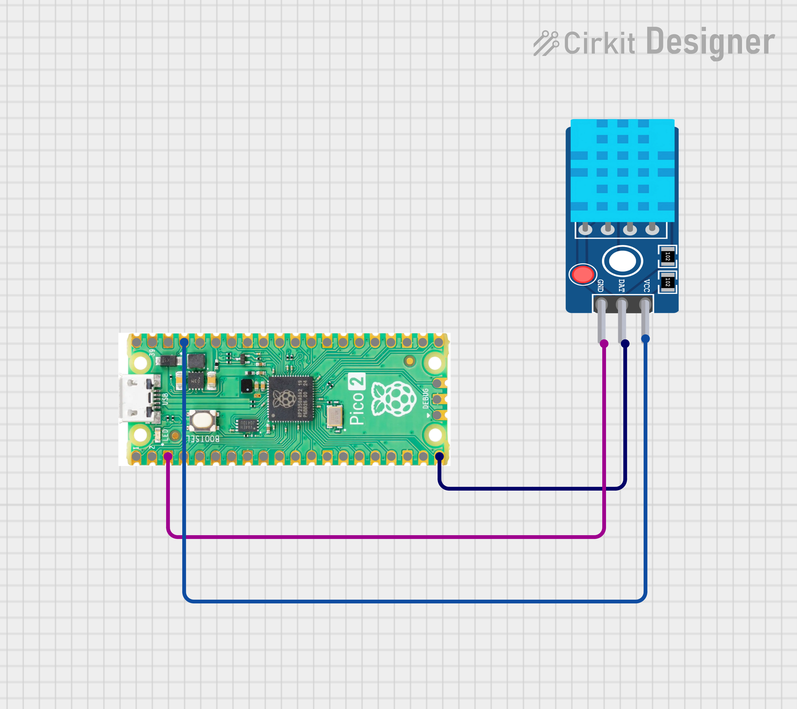

# Pico 2 W DHT22 HTTP CSV Data Logger

A simple and practical IoT project where a **Raspberry Pi Pico 2W** reads data from a **DHT11 temperature & humidity sensor** and sends it via **HTTP POST** to a **Flask server** running on a laptop. The server logs the data into a **CSV file** for analysis.

---

## 🔧 Features

* Reads **Temperature & Humidity** using DHT11
* Uses **Wi‑Fi (Pico 2W)** for communication
* Sends data via **HTTP POST (JSON)**
* **Flask server** receives data
* Automatic **CSV logging** with timestamp
* Works on **local network (same Wi‑Fi / hotspot)**

---

## 🧱 Hardware Required

* Raspberry Pi Pico W
* DHT22 Sensor
* Jumper wires

### 🔌 DHT22 Connections


| DHT22 | Pico W  |
| ----- | ------- |
| VCC   | 3.3V    |
| GND   | GND     |
| DATA  | GPIO 15 |

---

## 💻 Software Required

* MicroPython (Pico W firmware)
* Python 3.x (Laptop)
* Flask (`pip install flask`)

---


## 🚀 Flask Server Setup (Laptop)

### `app.py`

```python
from flask import Flask, request
import csv, os
from datetime import datetime

app = Flask(__name__)
CSV_FILE = "data.csv"

if not os.path.exists(CSV_FILE):
    with open(CSV_FILE, 'w', newline='') as f:
        csv.writer(f).writerow(["time", "temperature", "humidity"])

@app.route('/data', methods=['POST'])
def data():
    d = request.json
    print("Received:", d)

    with open(CSV_FILE, 'a', newline='') as f:
        csv.writer(f).writerow([
            datetime.now().strftime("%Y-%m-%d %H:%M:%S"),
            d["temperature"],
            d["humidity"]
        ])
    return "OK"

app.run(host="0.0.0.0", port=5000)
```

Run the server:

```bash
python app.py
```

Note your **Laptop IP address** (e.g. `192.168.43.101`).

---

## 📡 Pico W MicroPython Code

### `main.py`

```python
import network, time, urequests
import dht
from machine import Pin

ssid = "YOUR_WIFI_NAME"
password = "YOUR_WIFI_PASSWORD"

url = "http://YOUR_LAPTOP_IP:5000/data"

sensor = dht.DHT11(Pin(15))

wlan = network.WLAN(network.STA_IF)
wlan.active(True)
wlan.connect(ssid, password)

while not wlan.isconnected():
    time.sleep(1)

print("WiFi connected")

while True:
    sensor.measure()
    temp = sensor.temperature()
    hum = sensor.humidity()

    data = {
        "temperature": temp,
        "humidity": hum
    }

    try:
        r = urequests.post(url, json=data)
        r.close()
        print("Sent:", data)
    except Exception as e:
        print("Error:", e)

    time.sleep(5)
```

---

## 📊 CSV Output Example

```
time,temperature,humidity
2026-02-06 17:02:10,28.1,59.2
2026-02-06 17:02:15,28.0,59.1
```

The CSV file can be opened directly in **Excel / Google Sheets**.

---

## 🧠 How It Works

1. Pico 2 W connects to Wi‑Fi
2. Reads DHT11 sensor values
3. Sends data via HTTP POST (JSON)
4. Flask server receives data
5. Data is stored in CSV with timestamp

---

## 🛠 Troubleshooting

* Ensure **Pico 2 W and laptop are on the same Wi‑Fi network**
* Use **Laptop IP**, not `127.0.0.1`
* Make sure Flask server is running before Pico sends data

---

## 📌 Future Improvements

* Add LED / actuator status logging
* Plot graphs from CSV
* Web dashboard for live data
* Multiple device support

---


## ❤️Author
**Kritish Mohapatra**  
B.Tech Electrical Engineering (3rd Year)  
IoT | Embedded Systems | MicroPython | ESP32  

---

## ⭐ Support

If you like this project, give it a ⭐ on GitHub and feel free to fork it!

Happy hacking 🚀

