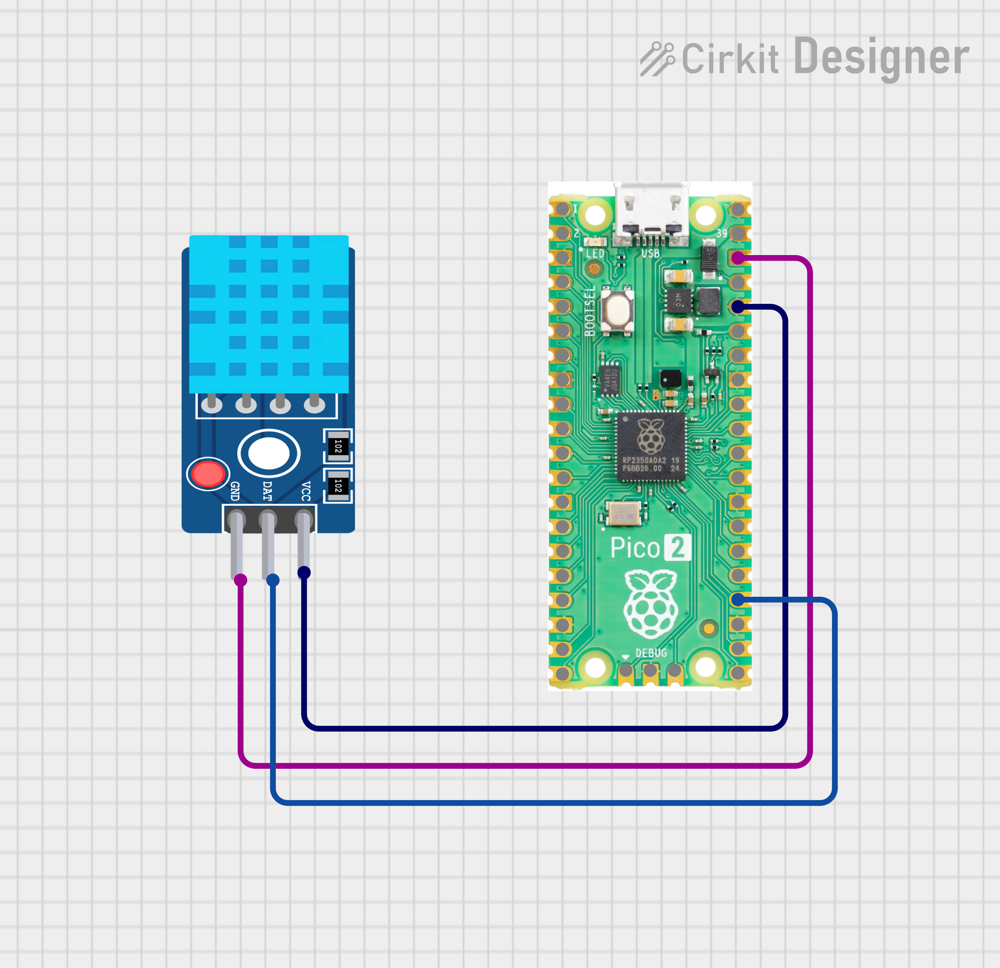
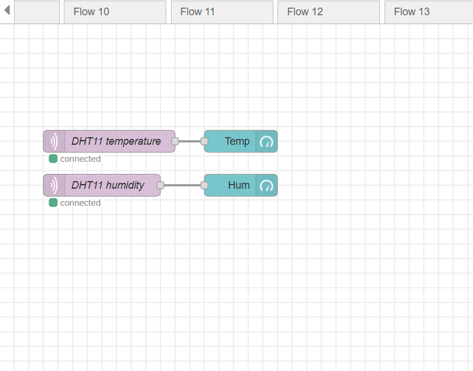
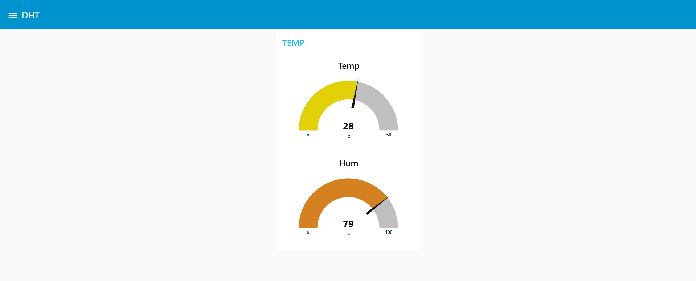

# Pico DHT11 MQTT Dashboard

A MicroPython project for Raspberry Pi Pico W that reads temperature and humidity from a DHT11 sensor and publishes the data to an MQTT broker, visualized via a Node-RED dashboard running in Docker on Oracle Cloud.

---

## Project Overview

The Pico W connects to Wi-Fi and continuously reads DHT11 sensor data every 5 seconds. It publishes temperature and humidity values to separate MQTT topics. Node-RED, running inside a Docker container on an Oracle Cloud VM, subscribes to these topics and displays live gauge widgets on a dashboard.

---

## Hardware Requirements

- Raspberry Pi Pico W
- DHT11 temperature and humidity sensor
- Jumper wires
- USB cable for flashing firmware

## Wiring




---

| DHT11 Pin | Pico W Pin |
|-----------|------------|
| VCC       | 3.3V       |
| GND       | GND        |
| DATA      | GP18       |

---

## Software Requirements

### On the Pico W

- MicroPython firmware
- `umqttsimple.py` library (place in the root of the Pico filesystem)
- Built-in `dht` and `network` modules (included in MicroPython)

### On Oracle Cloud VM

- Docker and Docker Compose
- Node-RED Docker image (`nodered/node-red`)
- An MQTT broker (e.g., Mosquitto) running in Docker or on the VM

---

## Configuration

Open `main.py` and update the following variables before flashing:

```python
SSID     = 'your_wifi_ssid'
PASSWORD = 'your_wifi_password'

SERVER   = 'your_oracle_vm_ip'
USER     = b'your_mqtt_username'
PASSWORD = b'your_mqtt_password'
```

---

## MQTT Topics

| Topic                      | Payload  | Description            |
|----------------------------|----------|------------------------|
| `pico/dht11/temperature`   | float    | Temperature in Celsius |
| `pico/dht11/humidity`      | float    | Relative humidity in % |

---

## Node-RED Flow Setup

1. Open Node-RED at `http://your-oracle-ip:1880`
2. Add two MQTT In nodes with the topics listed above
3. Connect each to a Gauge node from the dashboard palette
4. Configure gauges as follows:

| Gauge       | Units | Min | Max |
|-------------|-------|-----|-----|
| Temperature | C     | 0   | 50  |
| Humidity    | %     | 0   | 100 |

5. Deploy the flow
6. Open the dashboard at `http://your-oracle-ip:1880/ui`


---

## Demo

### Flow


### UI




## Notes

- The DHT11 sensor requires a minimum of 1 second between measurements; the script uses a 5-second interval which is safe.
- If the MQTT connection drops, the Pico will automatically reset and attempt to reconnect.
- Make sure port 1883 is open in your Oracle Cloud VM's security list and firewall rules.
- The `machine` module must be imported for the reconnect reset to work.
##  Author

**Kritish Mohapatra**  
B.Tech Electrical Engineering (3rd Year)  
IoT | Embedded Systems | MicroPython | ESP32  

---

## ⭐ Support

If you like this project, give it a ⭐ on GitHub and feel free to fork it!

Happy hacking 🚀

