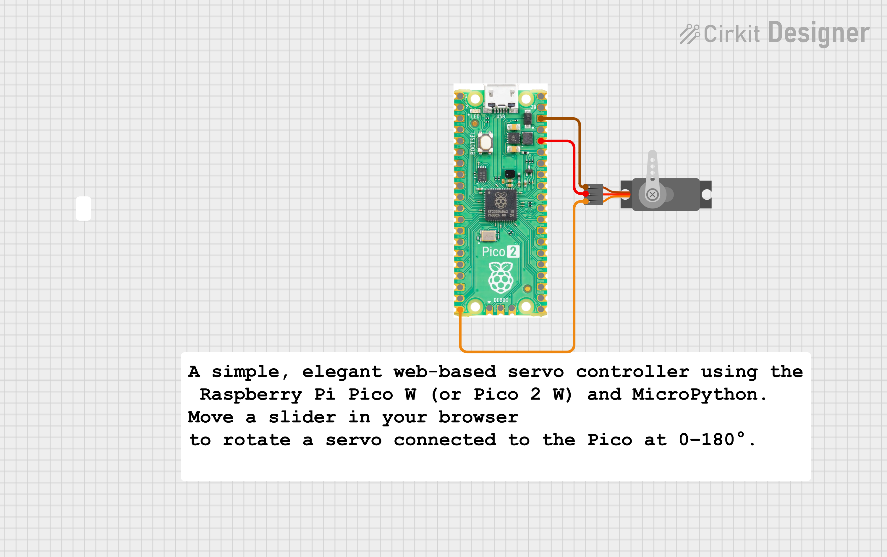

# Pico W Servo Controller

A simple, elegant web-based servo controller using the Raspberry Pi Pico W (or Pico 2 W) and MicroPython. Move a slider in your browser to rotate a servo connected to the Pico at 0–180°.

---

## 🔧 Features

- Wi-Fi enabled web interface served from the Pico W  
- Responsive HTML slider (0–180°) with smooth update  
- Safe angle clamping  
- Clean PWM duty-cycle mapping for servo control  

---

## 📦 Hardware Required

- Raspberry Pi Pico W / Pico 2 W  
- SG90 or any hobby servo  
- 5V power supply for servo  
- Jumper wires  
- Breadboard  

> ⚠️ Use common GND between servo power and Pico.

---

## 🔌 Wiring


| Servo Pin | Connect To |
|-----------|------------|
| Signal    | GP15       |
| VCC       | 5V         |
| GND       | GND        |

---


## 🚀 Setup

1. Flash MicroPython firmware on Pico W  
2. Upload `main.py` and `secrets.py`  
3. Reset the Pico  
4. Watch serial output → find IP address  
5. Open IP in browser → control servo  

---

## 📡 How It Works

- Pico starts an HTTP server on port 80  
- Browser slider sends:  
  ```
  GET /?value=90
  ```
- Code extracts `value`  
- Converts angle → pulse width → PWM duty  
- Updates servo instantly  

Servo pulse math:

```
SERVO_MIN_US = 500      # 0°
SERVO_MAX_US = 2500     # 180°
Period = 20,000 µs (50 Hz)
duty = (pulse_us / 20000) * 65535
```

---

## 🧭 Servo Calibration Tips

- If servo doesn't reach 0° → decrease `SERVO_MIN_US`  
- If servo doesn't reach 180° → increase `SERVO_MAX_US`  
- Add 50 µs steps for smooth tuning  

---

## 🛠️ Troubleshooting

- **No WiFi:** Check `ssid/password`, router range  
- **Servo jitter:** Use proper 5V supply + capacitor  
- **Page not opening:** Ensure phone/PC on same network  
- **Socket errors:** Reboot Pico  

---

## ⚠️ Security Notes

- Use local network only (no internet exposure)  
- Add simple PIN authentication if needed  

---

## ✨ Future Improvements

- Add presets (0°, 45°, 90°, 135°, 180° buttons)  
- Smooth tweening animation for servo  
- Real-time position feedback  
- Bootstrap UI / dark theme  

---

## 🧑‍💻 Author

**Kritish Mohapatra**  
MicroPython | ESP32 | Embedded Systems | IoT Projects  
GitHub: [https://github.com/kritishmohapatra]