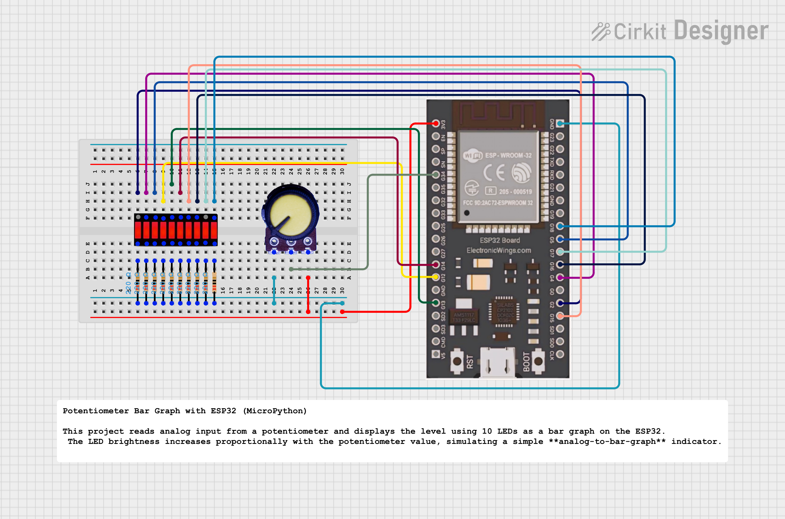

# Potentiometer Bar Graph with ESP32 (MicroPython)

This project reads analog input from a potentiometer and displays the level using 10 LEDs as a bar graph on the ESP32. The LED brightness increases proportionally with the potentiometer value, simulating a simple **analog-to-bar-graph** indicator.

---

##  Features

- Reads analog input from a potentiometer.  
- Maps ADC values (0–4095) to 10 LEDs.  
- Displays real-time bar graph of potentiometer level.  
- Prints analog value, level, and active LEDs to the serial monitor.

---

##  Hardware Required


| Component | Quantity | Description |
|------------|-----------|-------------|
| ESP32 Board | 1 | Main microcontroller |
| Potentiometer | 1 | Analog input sensor |
| LEDs | 10 | Bar graph display |
| Resistors (220Ω) | 10 | For each LED |
| Jumper Wires | As needed | For connections |
| Breadboard | 1 | For prototyping |

---

##  Pin Configuration


| LED Number | ESP32 Pin |
|-------------|------------|
| LED 1 | 2 |
| LED 2 | 4 |
| LED 3 | 5 |
| LED 4 | 12 |
| LED 5 | 13 |
| LED 6 | 14 |
| LED 7 | 15 |
| LED 8 | 16 |
| LED 9 | 17 |
| LED 10 | 18 |

**Potentiometer Input:**  
- Middle pin → GPIO 34 (Analog Input)  
- Other two pins → 3.3V and GND

---


##  Output Example

```
Analog Value: 1023, Level: 3, LEDs ON: [2, 4, 5]
Analog Value: 3072, Level: 8, LEDs ON: [2, 4, 5, 12, 13, 14, 15, 16]
Analog Value: 4095, Level: 10, LEDs ON: [2, 4, 5, 12, 13, 14, 15, 16, 17, 18]
```

---

##  Working Principle

- The **ADC** (Analog to Digital Converter) reads a voltage between 0–3.3V.  
- This value (0–4095) is scaled into **10 levels**.  
- Each level lights up one LED, creating a bar-graph-like visualization.  
- Rotating the potentiometer gradually lights up or turns off LEDs.

---

##  Future Enhancements

- Replace LEDs with an OLED display bar visualization.  
- Implement smoothing or filtering for stable readings.  
- Add color LEDs (RGB) for visual effects.  
- Display the percentage value on the web server using MicroPython.

---

##  Author

**Kritish Mohapatra**  
MicroPython | ESP32 | Embedded Systems | IoT Projects  
GitHub: [https://github.com/kritishmohapatra]
