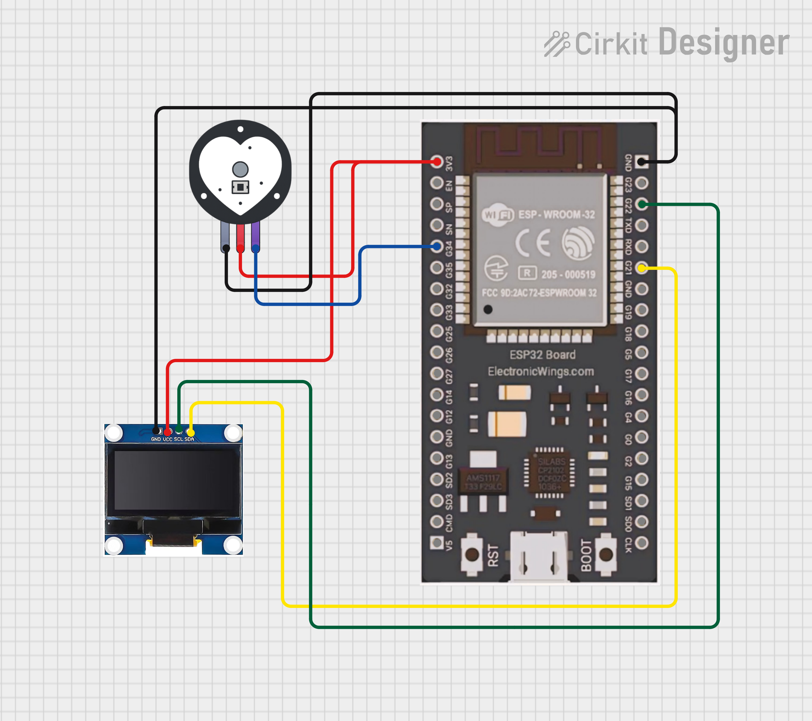

#  Pulse Monitor

A real-time heart rate monitor using an analog pulse sensor and ESP32, displaying live BPM and waveform on an SSD1306 OLED display — built with MicroPython.

---


##  Hardware Required

| Component | Quantity |
|-----------|----------|
| ESP32 | 1 |
| Analog Pulse Sensor Module | 1 |
| SSD1306 OLED Display (0.96", I2C) | 1 |
| Jumper Wires | Few |
| Breadboard | 1 |

---

##  Wiring



### Pulse Sensor → ESP32
| Pulse Sensor | ESP32 |
|-------------|-------|
| VCC (Red) | 3.3V |
| GND (Black) | GND |
| Signal | GPIO34 |

### OLED → ESP32
| OLED | ESP32 |
|------|-------|
| VCC | 3.3V |
| GND | GND |
| SDA | GPIO21 |
| SCL | GPIO22 |

---


##  Getting Started

### 1. Flash MicroPython
Flash MicroPython firmware on your ESP32 from [micropython.org](https://micropython.org/download/ESP32_GENERIC/).

### 2. Install ssd1306 library
In Thonny, install `ssd1306` via Tools → Manage Packages, or copy `ssd1306.py` to your ESP32.

### 3. Upload & Run
Upload `main.py` to ESP32 and run it. Place finger on the pulse sensor and watch the OLED come alive!

---


##  How It Works

- **ADC Reading** — Pulse sensor output is read via GPIO34 (ADC). `ATTN_11DB` enables full 0–3.3V range.
- **Peak Detection** — When ADC value crosses `THRESHOLD (2500)` and minimum interval has passed, a heartbeat is detected.
- **BPM Calculation** — Average time between last 10 peaks is used: `BPM = 60000 / avg_interval_ms`
- **Waveform Display** — Last 80 ADC samples are stored in a buffer and drawn as a scrolling line graph on the top half of OLED.
- **Heart Symbol** — Drawn pixel-by-pixel using `oled.pixel()` calls in a 7×5 grid pattern.

---

##  OLED Layout

```
┌────────────────────────┐
│      live waveform     │  ← top half (y: 0–37)
│────────────────────────│  ← divider
│  ❤ : 72 BPM           │  ← bottom half (y: 44)
└────────────────────────┘
```

---


## Author
**Kritish Mohapatra**  
B.Tech Electrical Engineering (3rd Year)  
IoT | Embedded Systems | MicroPython | ESP32  

---

## ⭐ Support

If you like this project, give it a ⭐ on GitHub and feel free to fork it!

Happy hacking 🚀
