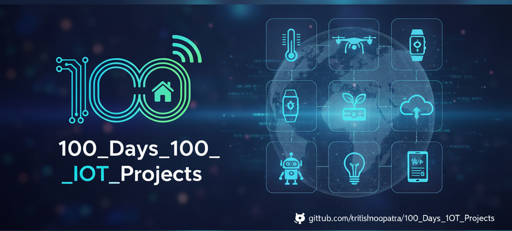

  
  
  
  
  

# 100 Days 100 IoT Projects 

Welcome to my **100 Days 100 IoT Projects** repository!  
This repo showcases my journey of learning and implementing **IoT & Embedded Systems projects** using **ESP32, Raspberry Pi Pico**, and **MicroPython**.  

Each project is designed to teach a specific concept, sensor, or IoT technique — from basic analog/digital readings to web-based dashboards.

---

## Technologies, Boards & Tools Used

###  Hardware
- ESP32, ESP8266 (NodeMCU)
- Raspberry Pi Pico / Pico W / Pico 2 W
- XIAO ESP32-S3
- Arduino (UNO / Nano)

###  Programming & Platforms
- MicroPython
- Python (Tkinter, CustomTkinter, Matplotlib)
- Arduino + Python (Serial, PyFirmata)

###  Sensors & Modules
- LDR, Potentiometer, DHT11
- PIR, IR, Ultrasonic (HC-SR04)
- Gas Sensors (MQ-4, MQ-7, MQ-135)
- RTC (DS3231), TM1637, OLED, LCD
- Relay, Servo, Touch Sensor

###  Concepts Covered
- ADC, PWM, GPIO
- Wi-Fi, Web Server, WebSocket
- Bluetooth, Blynk IoT
- Data logging & visualization
- Simulation-based testing

---

##  Project List
| Day | Project | Board / Sensor | Description |
|-----|----------|----------------|-------------|
| 1 | [Auto Night Light](Auto_Night_Light_using_LDR_(ESP32_+_MicroPython)/README.md) | ESP32 + LDR | Automatic LED turns ON/OFF based on ambient light |
| 2 | [Dimmer LED using Potentiometer](Dimmer_LED_using_Potentiometer_(MicroPython)/README.md) | ESP32 + Potentiometer | LED brightness controlled via potentiometer using ADC + PWM |
| 3 | [DHT11 Temperature & Humidity Web Server](DHT11_Web_Server_using_ESP32_&_MicroPython/README.md) | ESP32 + DHT11 | Reads temperature & humidity and displays on a live web page |
| 4 | [1-Digit Seven Segment Display](Single_Digit_Seven_Segment_Display_with_Raspberry_Pi-Pico_(MicroPython)/README.md) | Raspberry Pi Pico + 7-Segment | Displays numeric output using GPIO control |
| 5 | [Mini Weather Station (DHT11 + LCD)](DHT11_LCD_Display_using_ESP8266_&_MicroPython/README.md) | ESP8266 + DHT11 + I²C LCD | Displays real-time temperature & humidity on 16x2 LCD without flickering |
| 6 | [RGB Color Mixer using Potentiometers](RGB_Color_Mixer_using_Potentiometers_(ESP32_+_MicroPython)/README.md) | ESP32 + 3 Potentiometers + RGB LED | Mix RGB colors by adjusting potentiometers using ADC and PWM |
| 7 | [Potentiometer Bar Graph Display](Potentiometer_Visualizer/README.md) | ESP32 + Potentiometer + 10 LEDs | Visualize analog input as a 10-LED bar graph using ADC mapping |
| 8 | [MQ4 Gas Leak Detection System](MQ4_Gas_Leak_Detection_System_using_ESP32_and_MicroPython/README.md) | ESP32 + MQ4 Sensor + Buzzer | Detects methane gas concentration using MQ4 sensor and triggers alert when gas level exceeds threshold |
| 9 | [Basic RTC Clock (Serial Monitor Display)](Basic_RTC_Clock_(_Serial_Monitor_Display_)/README.md) | ESP8266 + DS3231 RTC | Displays real-time date, time, and temperature on Serial Monitor using DS3231 RTC |
| 10 | [IoT Button Counter using ESP8266 & MicroPython](IoT_Button_Counter_using_ESP8266_&_MicroPython/README.md) | ESP8266 + 3 Push Buttons | Counts button presses (Increment, Decrement, Reset) and displays live counter on webpage |
| 11 | [MicroPython-Based 8×8 LED Matrix Animation Display using ESP8266](MicroPython_Based_8×8_LED_Matrix_Animation_Display_using_ESP8266/README.md) | ESP8266 + MAX7219 8×8 LED Matrix | Displays custom animations (heart beat) on 8×8 LED matrix using MicroPython |
| 12 | [PIR Motion Detector using Raspberry Pi Pico 2W & MicroPython](PIR_Motion_Detector_using_Raspberry_Pi_Pico_2W_&_MicroPython/README.md) | Raspberry Pi Pico 2W + PIR Sensor | Detects motion using PIR sensor and indicates using built-in LED with MicroPython |
| 13 | [Bluetooth-Based Wireless LED Control System](Bluetooth_Based_Wireless_LED_Control_System/README.md) | Raspberry Pi Pico 2W + HC-05 | Wireless LED ON/OFF control using MicroPython + HC-05 Bluetooth module |
| 14 | [Pico W Web Servo Controller](Pico_W_Web_Servo_Controller/README.md) | Raspberry Pi Pico 2W + Servo Motor | Control servo angle (0–180°) from browser via WiFi |
| 15 | [ClimaPixel — Mini Weather Display](ClimaPixel_Mini_Weather_Display/README.md) | ESP32/ESP8266 + DHT11 + SSD1306 OLED | Real-time temperature & humidity display with icons on OLED using MicroPython |
| 16 | [TM1637 Button-Press Counter using ESP8266 & MicroPython](ESP8266_TM1637_Button_Press_Counter_(MicroPython)/README.md) | ESP8266 + TM1637 + Push Button | Counts button presses and displays live counter on TM1637 4-digit display |
| 17 | [IoT Relay Control Web Server (Raspberry Pi Pico 2W)](IoT_Relay_Control_Web_Server_(Raspberry_Pi_Pico_2W)/README.md) | Raspberry Pi Pico 2W + Relay Module | Web-based relay control using MicroPython with a smooth slide switch UI and real-time ON/OFF status over WiFi |
| 18 | [Blynk-Based IoT Relay Control (Raspberry Pi Pico 2 W)](Blynk_Based_IoT_Relay_Control_(MicroPython)/README.md) | Raspberry Pi Pico 2 W + Relay Module | Mobile app–based relay control using Blynk IoT and MicroPython with real-time ON/OFF control over Wi-Fi |
| 19 | [NTP Digital Clock using TM1637 & ESP8266 (MicroPython)](ESP8266_NTP_Digital_Clock_MicroPython/README.md) | ESP8266 + TM1637 | Internet-synchronized digital clock using NTP with accurate HH:MM display, blinking colon, and custom segment mapping in MicroPython |
| 20 | [Smart IR Object Detection System](Smart_IR_Object_Detection_System/README.md) | ESP8266 + IR Sensor + LED + Buzzer | Detects the presence of an object using an IR sensor and triggers LED and buzzer alerts in real time using MicroPython |
| 21 | [ESP32 Password Lock System](Password_Lock_System_using_ESP32/README.md) | ESP32 + Keypad + LCD + LEDs | Implements a secure password authentication system using a keypad and LCD with visual LED feedback, developed in MicroPython |
| 22 | [Blynk Controlled DC Brushless Fan](Blynk_Controlled_DC_Brushless_Fan/README.md) | Raspberry Pi Pico W + Relay + DC Brushless Fan | Controls a DC brushless fan remotely using the Blynk IoT platform and a relay module, implemented in MicroPython |
| 23 | [ESP32 Hotspot Setup](ESP32_Hotspot_(Access_Point)_Setup_MicroPython/README.md) | ESP32 | Configures ESP32 in Access Point (Hotspot) mode using MicroPython, enabling direct device-to-device connectivity without internet |
| 24 | [Voice-Controlled LED System](Voice_Activated_LED_Control_System/README.md) | Arduino + Python | Controls an LED using voice commands processed in Python and sent to Arduino via serial communication |
| 25 | [Arduino RGB LED Control with Python GUI](Interactive_LED_Control_System/README.md) | Arduino + Python | Controls an RGB LED using a Python GUI built with CustomTkinter and PyFirmata2, allowing color selection, individual LED on/off control, and brightness adjustment via sliders |
| 26 | [Clap Toggle Switch using ESP32 (MicroPython)](Clap_Toggle_Switch_using_ESP32_&_Digital_Sound_Sensor_(MicroPython)/README.md) | ESP32 + MicroPython | A clap-controlled toggle switch using a digital sound sensor where one clap turns the output ON and the next clap turns it OFF, implemented with debounce logic for reliable operation |
| 27 | [IR Sensor Telegram Alert using ESP32 (MicroPython)](ESP32_IR_Sensor_Telegram_Alert_(MicroPython)/README.md) | ESP32 + MicroPython | An IR sensor–based object detection system that sends real-time alert notifications to a Telegram channel whenever motion or object presence is detected near the sensor |
| 28 | [Soil Moisture Sensor Dry/Wet Detection using ESP8266 (MicroPython)](Soil_Moisture_Sensor_DryWet_Detection_(ESP8266_MicroPython)/README.md) | ESP8266 + MicroPython | A soil moisture monitoring system that reads analog sensor values and determines dry or wet soil conditions in real time, displaying the status on the serial monitor |
| 29 | [Rain Sensor Analog Detection using ESP8266 (MicroPython)](Rain_Detection_System_using_ESP8266_(Analog_Mode)/README.md) | ESP8266 + MicroPython | An analog rain detection system that reads real-time sensor values to determine rain intensity (no rain, light rain, heavy rain) and displays the status on the serial monitor |
| 30 | [Ultrasonic Distance Indicator using ESP32 (MicroPython)](Ultrasonic_LED_Distance_Indicator_ESP32_MicroPython/README.md) | ESP32 + MicroPython | A distance-based indication system using an HC-SR04 ultrasonic sensor that measures real-time distance and indicates object proximity using red and green LEDs |
| 31 | [WebSocket LED Control using Raspberry Pi Pico W](WebSocket_LED_Control_using_Raspberry_Pi_Pico_W/README.md) | Pico W + MicroPython | A real-time LED control system using WebSockets where a browser communicates directly with Raspberry Pi Pico W over WiFi to turn an LED ON or OFF without page refresh |
| 32 | [MQ-135 Gas Sensor with ESP32](MQ_135_Gas_Sensor_with_ESP32_(MicroPython)/README.md) | ESP32 + MicroPython | A gas level monitoring system using the MQ-135 sensor and ESP32 to read and average analog sensor values for stable environmental gas detection |
| 33 | [MQ-7 Carbon Monoxide Sensor with ESP32](MQ7_CO_Gas_Detection_ESP32/README.md) | ESP32 + MicroPython | A carbon monoxide monitoring system using the MQ-7 sensor and ESP32 to read and average analog sensor values for real-time CO detection |
| 34 | [Servo Motor Control with Raspberry Pi Pico 2 W](Servo_Motor_Control_with_Raspberry_Pi_Pico_2_W_(MicroPython)/README.md) | Raspberry Pi Pico 2 W + MicroPython | A simulation-based servo motor control project using PWM, where the user inputs an angle (0–180°) via serial monitor and the servo rotates accordingly with safe angle clamping |
| 35 | [ESP8266 Touch Sensor LED Control](ESP8266_Touch_Sensor_LED_Control_(MicroPython)/README.md) | ESP8266 (NodeMCU) + MicroPython | A capacitive touch-based toggle switch using the TTP223 touch sensor, where each touch alternates the state of an external LED with proper debounce handling |
| 36 | [ESP8266 DHT11 Live Monitor Matplotlib and MicroPython](ESP8266_DHT11_Live_Graph_(MicroPython_+_Matplotlib)/README.md) | ESP8266 + MicroPython + Matplotlib | Real-time DHT11 temperature and humidity visualization with a dark neon-themed live graph using serial communication |
| 37 | [XIAO ESP32 4-LED Control using CustomTkinter and MicroPython](XIAO_ESP32_4_LED_Control_using_CustomTkinter_&_MicroPython/README.md) | XIAO ESP32-S3 + MicroPython + CustomTkinter | Desktop GUI application to control four ESP32 GPIO LEDs via serial communication using a modern dark-mode CustomTkinter interface | ✅ |
| 38 | [ESP32 OLED Smart UI with Eyes Animation, Time & Weather (MicroPython)](ESP32_OLED_Smart_UI_Eyes_Animation_Time_&_Weather_(MicroPython)/README.md) | ESP32 + SSD1306 OLED + MicroPython | Interactive OLED UI featuring animated eyes, touch-based menu navigation, NTP-synced IST date & time, and live weather data using OpenWeatherMap API | ✅ |
| 39 | [ESP32 Stepper Motor Control using A4988 (MicroPython)](Stepper_Motor_Control_using_ESP32_&_A4988_(MicroPython)/README.md) | ESP32 + A4988 + NEMA 17 | Stepper motor control using STEP/DIR signals with direction control, speed adjustment via delay, and serial monitoring using print statements | ✅ |
| 40 | [Pico W Async LED Control (MicroPython)](Pico_W_Async_LED_Control_(MicroPython)/README.md) | Raspberry Pi Pico W | Async web server using uasyncio to control onboard LED via browser with ON/OFF buttons and fetch-based requests | ✅ |
| 41 | [EEPROM Simulation using MicroPython (ESP32)](EEPROM_Simulation_using_MicroPython_on_ESP32_(Wokwi)/README.md) | ESP32 | File-based EEPROM emulation using MicroPython with byte-level read/write and persistent string storage | ✅ |
| 42 | [ESP32 DC Motor Web Speed Control (MicroPython)](DC_Motor_Speed_Control_(Web_Slider)/README.md) | ESP32 + L298N | Web-based slider controlled DC motor speed system using PWM, MicroPython web server, and L298N driver | ✅ |
| 43 | [Temperature Based LED Indicator (MicroPython)](Temperature_Based_LED_Indicator_(MicroPython_ESP32)/README.md) | ESP32 + DHT22 | Beginner-friendly ESP32 project that reads temperature data from DHT22 and visually indicates temperature levels using LEDs | ✅ |
| 44 | [Flask LED Control using MicroPython](Flask_Server_Based_LED_Control_using_MicroPython/README.md) | ESP32 / Pico W | Beginner-friendly IoT project where a Flask web server controls an LED on ESP32 or Pico W through HTTP polling using MicroPython | ✅ |
| 45 | [Smart Cooling System using ESP8266](Smart_Cooling_System_using_ESP8266_DHT11_&_Relay/README.md) | ESP8266+DHT11+BRUSHLESS FAN | Beginner-friendly IoT project that automatically controls a fan using DHT11 temperature sensor and an active-LOW relay with MicroPython | ✅ |
| 46 | [Soil & Weather Monitoring using ESP8266 and ThingSpeak](IoT_Based_Soil_&_Weather_Monitoring_using_ESP8266_and_ThingSpeak/README.md) | ESP8266 + DHT11 + Soil Sensor | Beginner-friendly IoT project that monitors soil moisture, temperature, and humidity and visualizes the data on the ThingSpeak cloud using MicroPython | ✅ |
| 47 | [Smart Irrigation System using XIAO ESP32-S3 and Blynk](IoT_Smart_Irrigation_System/README.md) | XIAO ESP32-S3 + Soil Sensor + Relay + Pump | A smart irrigation system that monitors soil moisture in real time and allows manual water pump control via the Blynk IoT platform using MicroPython | ✅ |
| 48 | [HTTP-Based DHT11 Data Logger using Raspberry Pi Pico W](Pico_2_W_Dht11_Http_Csv_Logger/README.md) | Raspberry Pi Pico 2W + DHT11 | A simple IoT data logging system that reads temperature and humidity from a DHT11 sensor and sends the data via HTTP POST to a Flask server, where it is stored in a CSV file for analysis | ✅ |
| 49 | [ThingsBoard RPC LED Control & DHT11 Telemetry using Raspberry Pi Pico 2 W](Raspberry_Pi_Pico_2_W_ThingsBoard_IoT/README.md) | Raspberry Pi Pico 2 W + DHT11 | A cloud-connected IoT system using MicroPython where a Raspberry Pi Pico 2 W sends temperature and humidity data to ThingsBoard via MQTT and allows remote LED control using RPC from a dashboard | ✅ |
| 50 | [ESP32 BMP180 Atmospheric Monitoring with Blynk IoT](IoT_Atmospheric_Monitoring_System_using_ESP32,_wowki_&_Blynk/README.md) | ESP32 + BMP180 | A cloud-connected IoT system using MicroPython where an ESP32 measures temperature, atmospheric pressure, and altitude using the BMP180 sensor and sends real-time data to the Blynk IoT dashboard via Wi-Fi | ✅ |
| 51 | [ESP8266 Smart Home Automation using MicroPython & Blynk](Smart_Home_Automation_System/README.md) | ESP8266 + DHT11 + Relay | A cloud-based smart home automation system where an ESP8266 controls home appliances via relay and monitors temperature & humidity using DHT11, with real-time control and monitoring through the Blynk IoT dashboard over Wi-Fi | ✅ |
| 52 | [IoT Sensor Anomaly Detection using ESP8266 & ThingSpeak](IoT_Environment_Monitoring_With_Anomaly_Detection/README.md) | ESP8266 + DHT11 + LDR + MATLAB | An IoT-based environmental monitoring system that uploads real-time sensor data to ThingSpeak and performs statistical anomaly detection using Z-score analysis in MATLAB, with visualization and outlier classification | ✅ |
| 53 | [Smart IoT Gas Monitoring System](Smart_IoT_Gas_Monitoring_System/README.md) | ESP32 + MQ Gas Sensor + DHT11 + Flask + Chart.js | An AI-inspired end-to-end IoT gas monitoring system that streams real-time sensor data to a Flask backend, applies moving-average based anomaly detection for SAFE/DANGER classification, logs data for analytics, and visualizes live environmental insights on an interactive web dashboard | ✅ |
| 54 | [ESP8266 ESP-NOW LED Control](Led_ON_OFF_By_Input_from_one_ESP8266/README.md) | ESP8266 + ESP-NOW + MicroPython | A low-latency wireless LED control system using ESP-NOW protocol, where one ESP8266 acts as a transmitter and the other as a receiver, enabling real-time device control without WiFi infrastructure | ✅ |
| 55 | [ESP8266 ESP-NOW Button to LED Control](ESP8266_LED_CONTROL_BY_PUSH_BUTTON_ESP_NOW/README.md) | ESP8266 + ESP-NOW + MicroPython | A low-latency peer-to-peer wireless communication system where a push button on one ESP8266 toggles an LED on another ESP8266 without WiFi or access point | ✅ |
| 56 | [ESP8266 ESP-NOW 4-Channel Wireless Relay Controller](ESP_NOW_HOME_AUTOMATION/README.md) | ESP8266 + ESP-NOW + MicroPython | A wireless 4-channel relay control system using two ESP8266 boards, where push buttons on the sender toggle relays on the receiver via low-latency ESP-NOW communication without WiFi | ✅ |
| 57 | [ESP-NOW Smart Relay & Sensor System](ESP_NOW_HOME_AUTOMATION_WITH_TEMP_MONITORING_WITH_OLED/README.md) | ESP8266/ESP32 + ESP-NOW + MicroPython | A bidirectional ESP-NOW based smart relay and sensor system where a sender control panel toggles relays on a receiver and receives real-time DHT temperature and humidity data displayed on an OLED | ✅ |
| 58 | [NTP Synchronized LED Matrix Clock](NTP_Synchronized_Digital_Clock_using_ESP32_&_MAX7219/README.md) | ESP32 + MAX7219 + MicroPython + NTP | A real-time internet-synchronized digital clock using chained MAX7219 LED matrices, showing HH:MM with NTP time sync and serial debugging output | ✅ |
| 59 | [AQI-ESP - IoT AQI Monitoring System](AQI_ESP/README.md) | ESP32 + MicroPython + Flask + MQ135 + MQ7 + PM2.5 | A real-time air quality monitoring system using ESP32 and multiple gas sensors, calculating AQI via Flask backend and displaying live results on SSD1306 OLED with status like Good/Moderate/Unhealthy/Hazardous | ✅ |
| 60 | [Student Management System - ESP32](ESP32_Student_Management_System/README.md) | ESP32 + MicroPython + SH1106 OLED + LittleFS + ujson | A serial command-based student record management system running on ESP32, storing up to 1000 student records in JSON format on onboard flash memory with live navigation and display on SH1106 OLED | ✅ |
| 61 | [OTA Update - Raspberry Pi Pico 2 W](OTA_Update_Pico2W/README.md) | Raspberry Pi Pico 2 W + MicroPython + GitHub + urequests | A WiFi-based OTA (Over-the-Air) update system that automatically downloads and applies new code from GitHub on every boot without physically connecting the device to a computer | ✅ |
---
##  Key Highlights

-  Step-by-step progression from **basic to advanced IoT concepts**
-  Hands-on experience with **real hardware and simulations**
-  IoT dashboards using **Web Server, WebSocket & Blynk**
-  **Python & Matplotlib-based live data visualization**
-  Beginner-friendly **documentation & explanations**
-  Clean, folder-wise project organization

---
##  Roadmap

-  Complete **100 IoT projects in 100 days**
-  Each project includes:
  - `main.py`
  - Detailed `README.md`
  - Circuit diagram / simulation
-  Upcoming focus areas:
  - Cloud & IoT dashboards
  - OTA & firmware updates
  - Power optimization
  - Smart home & automation systems
  - AI-assisted IoT (basic level)
ation, and more  

---

##  Author

**Kritish Mohapatra**  
 Third Year B.Tech – Electrical Engineering  
 Interests: IoT | Embedded Systems | MicroPython | Automation  
 Building in public through #100DaysOfIoT

---

⭐ If you like this repository, give it a **star** on GitHub and follow for more IoT projects!
