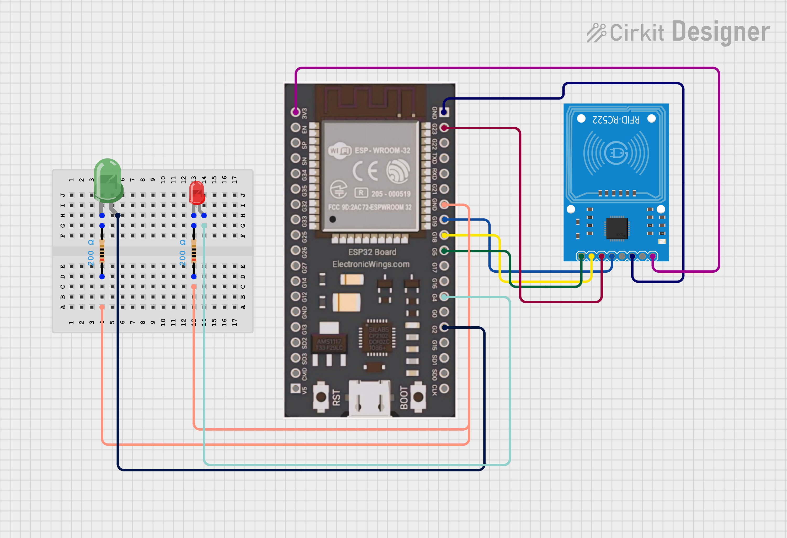

# RFID Attendance Logger


An RFID based attendance system that scans student cards and logs name, IN/OUT status, and NTP synced timestamp directly to Google Sheets via a Google Apps Script webhook.

---

## Hardware

| Component       | Model                |
|-----------------|----------------------|
| Microcontroller | ESP32                |
| RFID Reader     | MFRC522 (SPI, 3.3V)  |
| LEDs            | Green + Red          |
| Resistors       | 220 ohm x 2          |

---

## Wiring


| ESP32 Pin  | MFRC522 Pin |
|------------|-------------|
| 3V3        | 3.3V        |
| GND        | GND         |
| GPIO18     | SCK         |
| GPIO19     | MISO        |
| GPIO23     | MOSI        |
| GPIO5      | SDA/SS      |
| GPIO2      | Green LED   |
| GPIO4      | Red LED     |

Note: MFRC522 is 3.3V only. Do not connect VCC to 5V.

---

## Files

```
main.py     - main loop: scan, identify student, log to Google Sheets
mfrc522.py  - cefn/micropython-mfrc522 driver
```

---

## Google Apps Script Setup

1. Create a new Google Sheet and add headers in Row 1: `Timestamp`, `Student`, `Status`
2. Go to Extensions -> Apps Script
3. Paste this code:

```javascript
function doPost(e) {
  var sheet = SpreadsheetApp.getActiveSpreadsheet().getActiveSheet();
  var data  = JSON.parse(e.postData.contents);
  sheet.appendRow([data.timestamp, data.student, data.status]);
  return ContentService.createTextOutput("OK");
}
```

4. Save and go to Deploy -> New deployment
5. Type: Web app, Execute as: Me, Access: Anyone
6. Deploy and copy the URL
7. Paste the URL into `SCRIPT_URL` in main.py

---

## Setup

1. Copy `mfrc522.py` from https://github.com/cefn/micropython-mfrc522 to device
2. Copy `main.py` to device
3. Update WiFi credentials and Script URL in main.py
4. Scan each card once to discover UIDs, paste into `STUDENTS` dict
5. Run — each scan logs to Google Sheets automatically

---

## How It Works

- Card scan -> UID matched to student name
- First scan = IN, next scan = OUT, toggles on each tap
- NTP time fetched and IST offset (UTC+5:30) applied
- Data posted to Google Sheets via HTTP POST to Apps Script webhook
- Green LED = successfully logged, Red LED blinks = unknown card

---

## Google Sheets Output

| Timestamp           | Student   | Status |
|---------------------|-----------|--------|
| 2026-03-27 13:21:05 | Student 1 | IN     |
| 2026-03-27 13:22:43 | Student 2 | IN     |
| 2026-03-27 13:25:10 | Student 1 | OUT    |

---


## Author
**Kritish Mohapatra**  
B.Tech Electrical Engineering (3rd Year)  
IoT | Embedded Systems | MicroPython | ESP32  

---

## ⭐ Support

If you like this project, give it a ⭐ on GitHub and feel free to fork it!

Happy hacking 🚀
