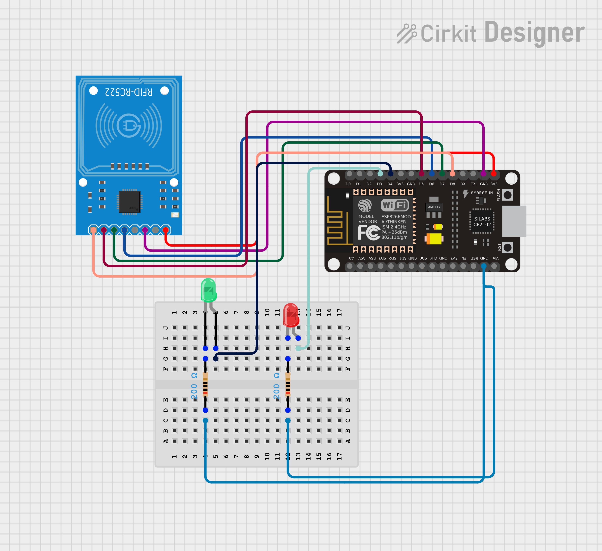

# RFID Basic Access Control System


A minimal RFID access control system that reads 13.56 MHz MIFARE cards and tags, checks their UID against an authorised list, and signals grant or deny via LEDs.

---

## Hardware

| Component       | Model                |
|-----------------|----------------------|
| Microcontroller | ESP8266 NodeMCU v3   |
| RFID Reader     | MFRC522 (SPI, 3.3V)  |
| LEDs            | Green + Red          |
| Resistors       | 220 ohm x 2          |

---

## Wiring


| ESP8266 Pin  | MFRC522 Pin |
|--------------|-------------|
| 3V3          | 3.3V        |
| GND          | GND         |
| D5 (GPIO14)  | SCK         |
| D6 (GPIO12)  | MISO        |
| D7 (GPIO13)  | MOSI        |
| D8 (GPIO15)  | SDA/SS      |
| D4 (GPIO2)   | Green LED   |
| D3 (GPIO0)   | Red LED     |

Note: MFRC522 is 3.3V only. Do not connect VCC to 5V.

---

## Files

```
main.py     - main loop: scan, check UID, LED feedback
mfrc522.py  - cefn/micropython-mfrc522 driver
```

---

## Setup

1. Copy mfrc522.py from https://github.com/cefn/micropython-mfrc522 to device.
2. Copy main.py to device.
3. Run in enrolment mode (AUTHORISED list empty) to discover your card UID.
4. Paste the UID into the AUTHORISED list in main.py.
5. Re-run. Authorised card = green LED, any other card = red LED blinks 3 times.

---

## Serial Output

```
RFID Access Control
Hold card near reader...
Card UID: 9A:DB:8A:04:CF
[GRANTED] 9A:DB:8A:04:CF
Card UID: 59:8A:D6:05:00
[DENIED]  59:8A:D6:05:00
```

---


## Author
**Kritish Mohapatra**  
B.Tech Electrical Engineering (3rd Year)  
IoT | Embedded Systems | MicroPython | ESP32  

---

## ⭐ Support

If you like this project, give it a ⭐ on GitHub and feel free to fork it!

Happy hacking 🚀
