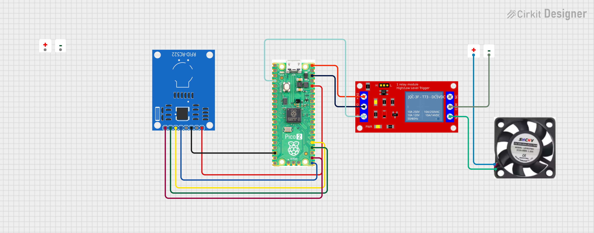

# RFID Relay Control System


An RFID based relay control system. Tap an authorized card to toggle a 5V brushless fan ON or OFF via a relay module.

---

## Hardware

| Component       | Model                     |
|-----------------|---------------------------|
| Microcontroller | Raspberry Pi Pico 2       |
| RFID Reader     | MFRC522 (SPI, 3.3V)       |
| Relay Module    | 1 Channel Active Low      |
| Fan             | 5V Brushless              |

---

## Wiring


| Pico 2 Pin | MFRC522 Pin |
|------------|-------------|
| 3V3        | 3.3V        |
| GND        | GND         |
| GP18       | SCK         |
| GP16       | MISO        |
| GP19       | MOSI        |
| GP17       | SDA/SS      |

| Pico 2 Pin | Relay Pin |
|------------|-----------|
| VBUS (5V)  | VCC       |
| GND        | GND       |
| GP2        | IN        |

| Relay Pin | Fan        |
|-----------|------------|
| COM       | -ve        |
| NO        | Fan -     |


---

## Files

```
main.py     - main loop: scan card, toggle relay
mfrc522.py  - cefn/micropython-mfrc522 driver
```

---

## How It Works

- Authorized card tap → relay toggles ON, fan starts
- Same card tap again → relay toggles OFF, fan stops
- Unknown card → Unknown card printed on serial
- Relay is active low — GP2 LOW = relay ON, GP2 HIGH = relay OFF
- Debounce of 2000ms prevents repeat reads

---

## Serial Output

```
Day 74 - RFID Relay Control
Hold card to toggle fan...
Fan: ON
Fan: OFF
Fan: ON
Unknown card
```

---


## Author
**Kritish Mohapatra**  
B.Tech Electrical Engineering (3rd Year)  
IoT | Embedded Systems | MicroPython | ESP32  

---

## ⭐ Support

If you like this project, give it a ⭐ on GitHub and feel free to fork it!

Happy hacking 🚀
