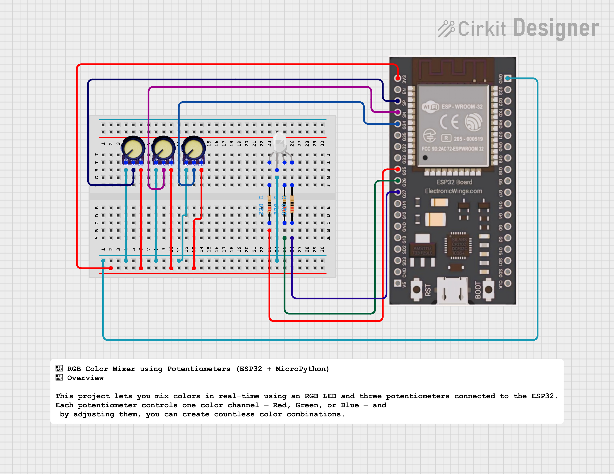

# 🎨 RGB Color Mixer using Potentiometers (ESP32 + MicroPython)

## 📘 Overview  
This project lets you **mix colors in real-time** using an **RGB LED** and **three potentiometers** connected to the **ESP32**.  
Each potentiometer controls one color channel — **Red**, **Green**, or **Blue** — and by adjusting them, you can create countless color combinations.  

---

## ⚙️ Hardware Required  
- 🧠 ESP32 development board  
- 💡 RGB LED (Common Cathode or Common Anode)  
- 🎚️ 3 × 10kΩ potentiometers  
- 🔌 Jumper wires  
- 🧱 Breadboard  
- 3 x 220 ohm resistors
---

## 🔌 Circuit Connections  



| Component | ESP32 Pin | Description |
|------------|------------|-------------|
| RGB Red pin | 25 | PWM output for Red |
| RGB Green pin | 26 | PWM output for Green |
| RGB Blue pin | 27 | PWM output for Blue |
| Potentiometer (Red) | 36 | ADC input for Red |
| Potentiometer (Green) | 39 | ADC input for Green |
| Potentiometer (Blue) | 34 | ADC input for Blue |
| Common LED pin | GND (for Common Cathode) / 3.3V (for Common Anode) | — |

> ⚠️ **Tip:** If your LED lights up in reverse (on when expected off), set `invert = True` in the code.  

---

## ⚙️ How It Works  

The ESP32 reads the position of each **potentiometer** using its **ADC (Analog-to-Digital Converter)**.  
Each potentiometer provides a voltage between **0V and 3.3V**, which is converted into a digital value between **0 and 4095**.

This value is then **mapped** to a **PWM duty cycle** (0–1023) to control the brightness of each LED color channel:

```python
# Convert ADC value (0–4095) to PWM duty (0–1023)
def map_adc_to_duty(x):
    return int(x * 1023 / 4095)
```

The **PWM (Pulse Width Modulation)** signal determines how bright the LED glows:  
- A **higher duty value** means the LED is **brighter**.  
- A **lower duty value** means the LED is **dimmer**.  

Each RGB color channel (Red, Green, Blue) is controlled independently:
```python
r = map_adc_to_duty(a_r.read())  # Red intensity
g = map_adc_to_duty(a_g.read())  # Green intensity
b = map_adc_to_duty(a_b.read())  # Blue intensity
```

Then, these values are applied to the PWM pins:
```python
p_r.duty(r)
p_g.duty(g)
p_b.duty(b)
```

By adjusting the potentiometers, you control the **mixing ratio** of Red, Green, and Blue light.  
When all three are combined in different intensities, you get different colors — just like how pixels on a display work!

> 💡 Example:  
> - Full Red + Full Green = **Yellow**  
> - Full Green + Full Blue = **Cyan**  
> - Full Red + Full Blue = **Magenta**  
> - All Full = **White**
---

## 🎨 Color Mixing Examples  

| R | G | B | Output Color |
|---|---|---|---------------|
| 1023 | 0 | 0 | 🔴 Red |
| 0 | 1023 | 0 | 🟢 Green |
| 0 | 0 | 1023 | 🔵 Blue |
| 1023 | 1023 | 0 | 🟡 Yellow |
| 0 | 1023 | 1023 | 🔵 Cyan |
| 1023 | 0 | 1023 | 🟣 Magenta |
| 1023 | 1023 | 1023 | ⚪ White |

---

## 🚀 Applications  

- 🎨 **Color Mixer Demo:** Learn how RGB color blending works using analog inputs.  
- 💡 **Lighting Control:** Basis for smart lighting or ambient color systems.  
- 🧠 **IoT Learning Project:** Great beginner project to understand ADC, PWM, and RGB control using MicroPython.  
- 📺 **Display & UI Design:** Concept used in RGB displays, LED strips, and custom dashboards.  
- 🧰 **Sensor Interface Example:** Demonstrates reading analog values and controlling outputs in real-time.  

---

## 🔮 Future Enhancements  

- 📊 **OLED Display Integration:** Show live RGB values or hex color codes on screen.  
- 🌐 **Web Dashboard:** Control RGB values from a webpage hosted on the ESP32.  
- 📱 **Mobile App Control:** Use Bluetooth/Wi-Fi to adjust RGB values wirelessly.  
- ⚡ **Save Presets:** Store favorite colors in flash memory (LittleFS).  
- 🌈 **Automatic Color Transition Mode:** Add smooth fade or animation effects.  

---

## 👨‍💻 Author  

**Kritish Mohapatra**  
Part of *100 Days 100 IoT Projects* — MicroPython Series 🚀  
Focused on **IoT**, **Embedded Systems**, and **Smart Automation Projects**.  

📧 *For collaborations or learning content, stay tuned on upcoming projects!*  