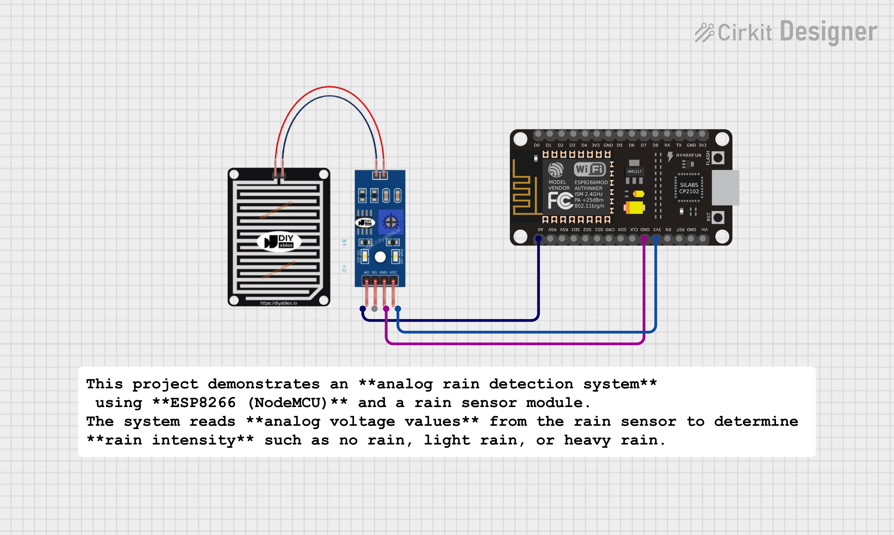

# 🌧️ Rain Detection System using ESP8266 (Analog Mode)

## 📌 Project Overview
This project demonstrates an **analog rain detection system** using **ESP8266 (NodeMCU)** and a rain sensor module.  
The system reads **analog voltage values** from the rain sensor to determine **rain intensity** such as no rain, light rain, or heavy rain.

This project is part of **Day 29** of the IoT learning and project-building series.

---

## 🎯 Objectives
- Interface a rain sensor with ESP8266  
- Read **analog sensor values** using ADC  
- Detect rain intensity based on sensor readings  
- Display real-time values on Serial Monitor  
- Build a practical weather-monitoring IoT project  

---

## 🧰 Components Used
- ESP8266 (NodeMCU)
- Rain Sensor Module (FC-37 / YL-83)
- LED (optional)
- 220Ω Resistor
- Breadboard
- Jumper Wires

---

## 🔌 Circuit Connections (Analog Only)


| Rain Sensor Pin | ESP8266 (NodeMCU) |
|-----------------|------------------|
| VCC             | 3V               |
| GND             | GND              |
| AO              | A0               |

> ⚠️ **Note:**  
> Only **Analog Output (AO)** is used.  
> **Digital Output (DO)** is not connected.

---

## 🧠 Working Principle
- The rain sensor acts as a variable resistor.
- When water droplets fall on the sensor surface:
  - Resistance decreases
  - Analog voltage level changes
- ESP8266 reads this voltage using **ADC (A0)**.
- Based on the analog value:
  - High value → No Rain  
  - Medium value → Light Rain  
  - Low value → Heavy Rain  

---

## 💻 Software & Platform
- MicroPython
- ESP8266 NodeMCU
- Thonny / uPyCraft IDE

---

## 📊 Sample Output
```text
Rain Analog Value: 910 → No Rain
Rain Analog Value: 620 → Light Rain
Rain Analog Value: 280 → Heavy Rain
```
---


## 🧪 Calibration

Sensor values may vary based on:
- Sensor quality
- Environment conditions
- Moisture level

### Calibration Steps
1. Note the ADC value when the sensor is completely dry  
2. Sprinkle water on the sensor and observe value changes  
3. Adjust threshold values in the code accordingly  

---

## 🚀 Future Enhancements
- Web-based rain monitoring dashboard  
- Upload data to ThingSpeak / Firebase  
- Smart irrigation system (rain detected → motor OFF)  
- Weather station integration (Rain Sensor + DHT11)  
- Mobile notification alerts  

---

## 📝 Key Learning Outcomes
- ESP8266 ADC usage  
- Analog sensor interfacing  
- Sensor calibration techniques  
- Real-world IoT weather monitoring concepts  
---
## 🧑‍💻 Author
**Kritish Mohapatra**  
MicroPython | ESP32 | Embedded Systems | IoT Projects  
GitHub: [https://github.com/kritishmohapatra]

## ⭐ Support

If you like this project, give it a ⭐ on GitHub  
and feel free to fork or improve it!