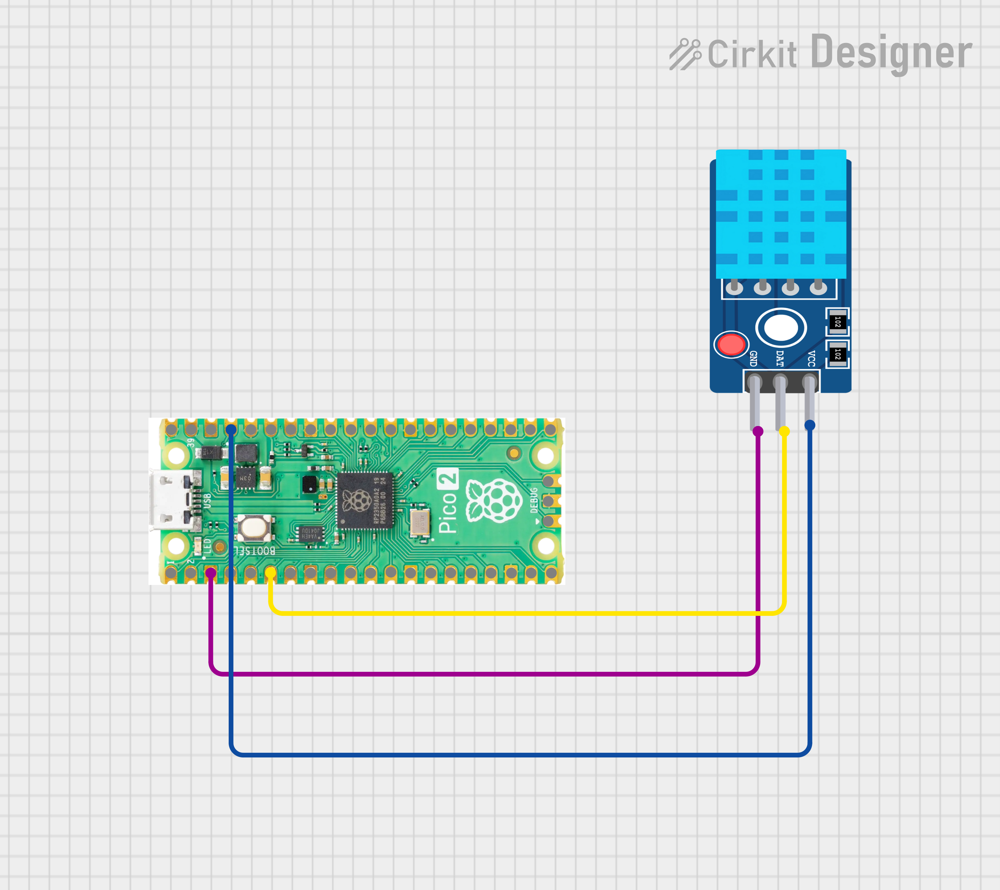
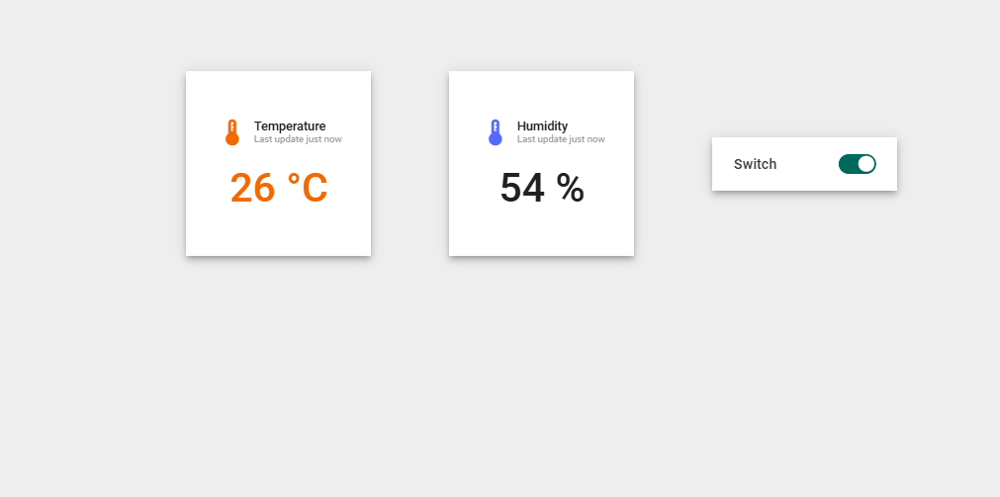

#  Raspberry Pi Pico 2 W + ThingsBoard IoT  
### LED Control via RPC & DHT11 Telemetry (MicroPython)

This project demonstrates how to connect a **Raspberry Pi Pico 2 W (RP2350)** to **ThingsBoard Cloud** using **MQTT**, enabling:

-  Remote LED ON/OFF control using RPC
-  Temperature &  Humidity monitoring using DHT11
-  Real-time telemetry updates to ThingsBoard dashboard

---

##  Features

- WiFi connectivity using Pico 2 W
- MQTT communication with ThingsBoard Cloud
- RPC-based LED control from dashboard
- Periodic telemetry publishing
- Auto-recovery on runtime errors

---

##  Hardware Requirements

- **Raspberry Pi Pico 2 W (RP2350)**
- DHT11 Temperature & Humidity Sensor
- (Optional) External LED
- Jumper wires
- WiFi connection

---

##  Pin Connections

| Component | Pico 2 W Pin |
|---------|--------------|
| DHT11 Data | GPIO 4 |
| LED | Onboard LED |

---

##  ThingsBoard Configuration

1. Create a device in ThingsBoard
2. Copy the **Access Token**
3. Use the following MQTT details:
```
Host : eu.thingsboard.cloud
Port : 1883
Username : <ACCESS_TOKEN>
Password : (leave empty)
```


 **Note:** ThingsBoard MQTT does **not** require a password when using access token authentication.

---

##  MQTT Topics Used

| Purpose | Topic |
|-------|------|
| Telemetry | `v1/devices/me/telemetry` |
| RPC Request | `v1/devices/me/rpc/request/+` |
| RPC Response | `v1/devices/me/rpc/response/{requestId}` |

---

##  RPC Methods Supported

### 1️ setState (LED Control)

```json
{
  "method": "setState",
  "params": true
}


true → LED ON

false → LED OFF
```

### 2️ getState (Dashboard Sync)
```json
{
  "method": "getState"
}
```


Returns current LED state to ThingsBoard dashboard.

##  Telemetry Data Sent

Every 10 seconds, the following data is published:
```json
{
  "temperature": 28,
  "humidity": 65,
  "ledStatus": true
}
```
---
## DashBoard

##  Applications

- Smart Home LED Control

- IoT Learning & Practice Project

- Cloud-connected Embedded System Demo

- Internship / Mini Project

- GitHub Portfolio Project

##  Learning Outcomes

- MQTT communication with cloud

- ThingsBoard dashboard & RPC usage

- MicroPython on Pico 2 W

- Sensor integration (DHT11)

- Fault-tolerant embedded design

- Real-world IoT architecture

##  Future Enhancements

- Add relay or motor control

- Multiple RPC commands

- Data logging & analytics

- Mobile dashboard access

- OTA firmware update
---

## Author
**Kritish Mohapatra**  
B.Tech Electrical Engineering (3rd Year)  
IoT | Embedded Systems | MicroPython | ESP32  

---

## ⭐ Support

If you like this project, give it a ⭐ on GitHub and feel free to fork it!

Happy hacking 🚀

