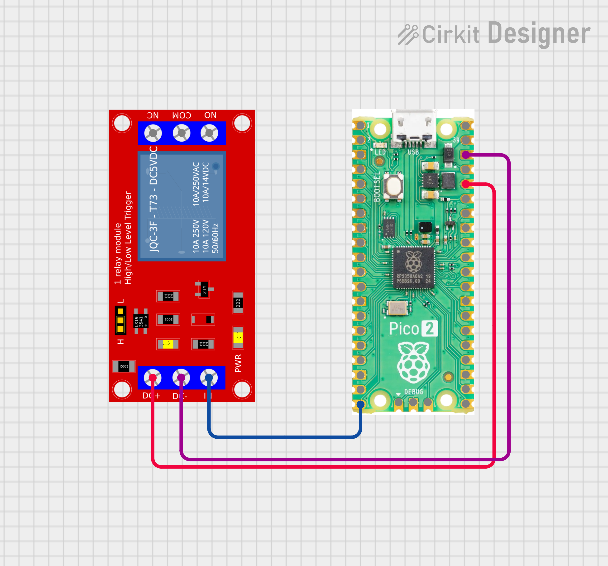
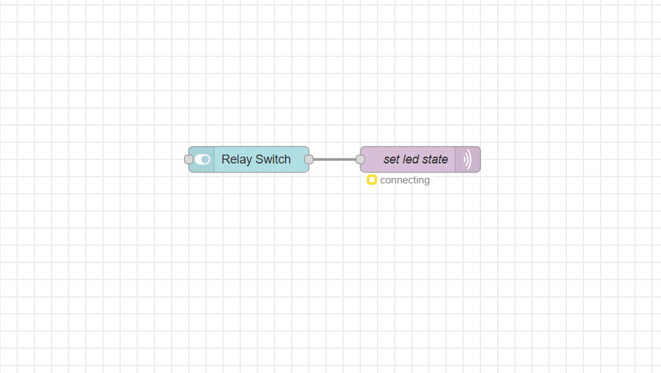

#  Relay Control via Node-RED & MQTT

Control a relay module on a Raspberry Pi Pico 2W remotely using a Node-RED dashboard switch over MQTT.

---

##  Hardware Required

- Raspberry Pi Pico 2W
- Relay module connected to **GP15**
- PC running **Node-RED** with **Mosquitto MQTT broker**

---
### Wiring



##  Setup

### 1. MQTT Broker (Mosquitto)
Make sure Mosquitto is running on your PC with authentication enabled.

In `mosquitto.conf`:
```
allow_anonymous false
password_file /etc/mosquitto/passwd
listener 1883
```

### 2. Pico W — `main.py`
Update these variables before flashing:

```python
SSID     = 'your_wifi_ssid'
PASSWORD = 'your_wifi_password'
SERVER   = '192.168.x.x'   # Your PC's local IP
USER     = b'mqtt_user'
PASSWORD = b'your_mqtt_password'
```

Flash the code using **Thonny** or `mpremote`.

### 3. Node-RED Flow
Import or build this flow:

```
[Switch node] → [MQTT Out node]
```

- **Switch node**: Dashboard toggle, outputs `on` / `off`
- **MQTT Out node**:
  - Server: `your_pc_ip:1883`
  - Topic: `relay_control`
  - Username & Password: same as Mosquitto config

---

##  How It Works

```
Node-RED Dashboard Switch
        ↓  (MQTT publish)
  Mosquitto Broker
        ↓  (subscribe)
   Raspberry Pi Pico W
        ↓
    LED ON / OFF (GP15)
```

1. Toggle the switch in Node-RED dashboard (`http://localhost:1880/ui`)
2. Node-RED publishes `on` or `off` to topic `relay_control`
3. Pico W receives the message via `wait_msg()` and toggles the LED

---

##  Notes

- Relay module on **GP15** (active low): `value(0)` = ON, `value(1)` = OFF
- Uses `wait_msg()` (blocking) — suitable for dedicated listener; swap to `check_msg()` + `sleep()` if you need the Pico to do other tasks simultaneously
- `keepalive=3600` keeps the MQTT connection alive without frequent reconnects

---

##  Dependencies

- [`umqttsimple`](https://github.com/micropython/micropython-lib/tree/master/micropython/umqtt.simple) — lightweight MQTT client for MicroPython

---

## Demo
### Flows

### Ui


---


##  Author

**Kritish Mohapatra**  
B.Tech Electrical Engineering (3rd Year)  
IoT | Embedded Systems | MicroPython | ESP32  

---

## ⭐ Support

If you like this project, give it a ⭐ on GitHub and feel free to fork it!

Happy hacking 🚀

