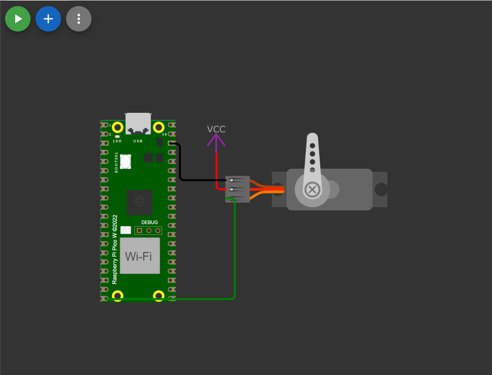

# 🧠 Servo Motor Control with Raspberry Pi Pico 2 W (MicroPython)

## 📌 Project Overview
This project demonstrates **servo motor angle control** using **Raspberry Pi Pico 2 W** and **MicroPython**.  
The user can **enter an angle (0–180°)** via serial input, and the servo rotates accordingly.  
The system includes **angle validation, safe clamping, and debug print outputs**.

> ⚠️ This is a **simulation / learning project**, intended for understanding PWM-based servo control logic.

---

## 🎯 Features
- ✅ Serial input–based angle control  
- ✅ Safe angle clamping (20°–170°)  
- ✅ PWM-based servo control (50Hz)  
- ✅ Debug output using `print()`  
- ✅ Beginner-friendly & calibrated logic  

---

## 🛠️ Components Used
- Raspberry Pi **Pico 2 W**
- Servo Motor (SG90 / equivalent)
- External 5V power supply
- Jumper wires

---

## 🔌 Pin Configuration

| Servo Pin | Pico 2 W |
|---------|----------|
| Signal  | GPIO 15  |
| VCC     | External 5V |
| GND     | GND (Common) |

⚠️ **Important:**  
Servo motor must be powered using an **external 5V supply**.  
Pico and servo **GND must be common**.

---

## 🧠 Working Principle
- Servo motors operate using a **50Hz PWM signal**
- Angle input is mapped to a **PWM duty cycle**
- Due to **mechanical constraints**, most hobby servos safely operate between **20°–170°**
- Software-based **angle clamping** prevents mechanical damage

---
## 🖥️ Sample Output (Serial Monitor)

Enter angle (0-180): 10
Requested Angle: 20
PWM Duty Applied: 1786

Enter angle (0-180): 90
Requested Angle: 90
PWM Duty Applied: 5000

Enter angle (0-180): 180
Requested Angle: 170
PWM Duty Applied: 8350

---

## 🧪 Simulation Notes
- This is a **simulation-based project**
- Focuses on **PWM logic and control**
- No mechanical load is considered
- Suitable for **learning and demonstration purposes**

---
## 🔗 Live Simulation

Live simulation of this project is available here:

👉 https://wokwi.com/projects/453152105774150657

> Note: This is a **simulation-based project** created for learning and demonstration purposes.

## 🚀 Future Enhancements
- Web-based servo control using **Pico 2 W Wi-Fi**
- Potentiometer-based angle control
- OLED display for **real-time angle visualization**
- Servo integration with sensors (**Ultrasonic / AQI**)

## 🧑‍💻 Author

**Kritish Mohapatra**  
MicroPython | ESP32 | Embedded Systems | IoT Projects  
GitHub: [https://github.com/kritishmohapatra]

## ⭐ Support

If you like this project, give it a ⭐ on GitHub  
and feel free to fork or improve it!
