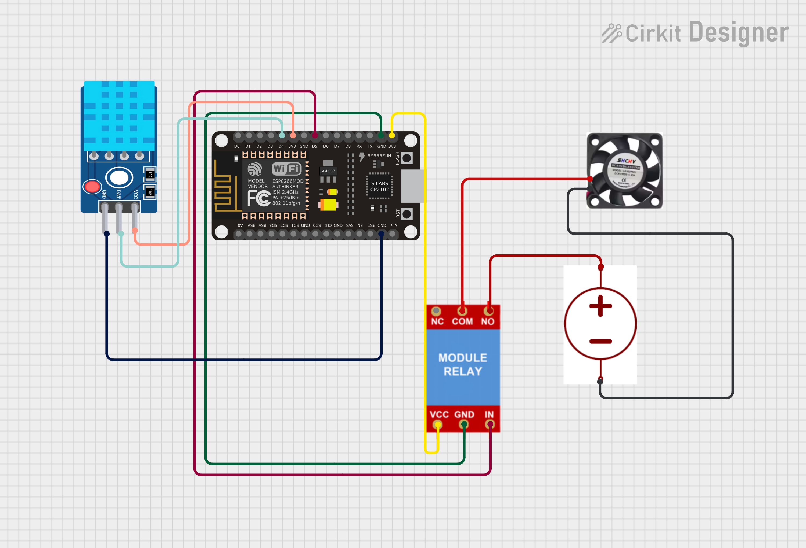

# 🌬️ Smart Cooling System using ESP8266, DHT11 & Relay (MicroPython)

A simple **Smart Cooling System** that automatically turns a **fan ON/OFF** based on room temperature using **ESP8266**, **DHT11 sensor**, and an **active-LOW relay**, programmed in **MicroPython**.

---

## 📌 Features
- 🌡️ Real-time temperature & humidity monitoring
- 🔁 Automatic fan control using temperature threshold
- 🔌 Active-LOW relay support
- 🧠 Simple & beginner-friendly logic
- ⚡ Low power & cost-effective

---

## 🧰 Components Required
- ESP8266 (NodeMCU)
- DHT11 Temperature & Humidity Sensor
- 1-Channel Relay Module (Active-LOW)
- DC Fan / AC Load
- Jumper Wires
- Breadboard
- External power (if required for fan)

---


## 🔌 Pin Connections



### DHT11 → ESP8266
| DHT11 Pin | ESP8266 |
|----------|---------|
| VCC | 3.3V |
| GND | GND |
| DATA | D4 (GPIO2) |

### Relay → ESP8266
| Relay Pin | ESP8266 |
|----------|---------|
| IN | D5 (GPIO14) |
| VCC | 5V (Vin) |
| GND | GND |

⚠️ **Note:** Do NOT connect fan directly to ESP8266. Always use relay or transistor.

---

## ⚙️ Working Principle
1. ESP8266 reads temperature & humidity from DHT11
2. If **Temperature ≥ 30°C**
   - Relay turns **ON**
   - Fan starts running
3. If **Temperature < 30°C**
   - Relay turns **OFF**
   - Fan stops
4. System keeps monitoring every 2 seconds

---

## 🧠 Logic for Active-LOW Relay
- `0 (LOW)` → Relay ON → Fan ON
- `1 (HIGH)` → Relay OFF → Fan OFF

---

## 🧪 MicroPython Code
```python
import dht
import machine
import time

# Pin configuration
dht_pin = machine.Pin(2)                    # D4
fan_pin = machine.Pin(14, machine.Pin.OUT)  # D5 (Relay)

sensor = dht.DHT11(dht_pin)

TEMP_THRESHOLD = 30  # Celsius

FAN_ON  = 0   # Active LOW relay
FAN_OFF = 1

fan_pin.value(FAN_OFF)  # Fan OFF at startup

while True:
    try:
        sensor.measure()
        temp = sensor.temperature()
        hum = sensor.humidity()

        print("Temperature:", temp, "°C")
        print("Humidity:", hum, "%")

        if temp >= TEMP_THRESHOLD:
            fan_pin.value(FAN_ON)
            print("Fan ON 🔥")
        else:
            fan_pin.value(FAN_OFF)
            print("Fan OFF ❄️")

    except Exception as e:
        print("Error:", e)

    time.sleep(2)
```
---
## 🚀 Future Enhancements
- 📟 OLED Display (SSD1306) for real-time temperature & fan status
- 🌐 Web Dashboard using ESP8266 Web Server
- 🔘 Manual ON/OFF Override Button
- 🎚️ Fan Speed Control using PWM
- ☁️ IoT Cloud Integration (MQTT / ThingSpeak)
---
## ❤️Author
**Kritish Mohapatra**  
B.Tech Electrical Engineering (3rd Year)  
IoT | Embedded Systems | MicroPython | ESP32  

---

## ⭐ Support

If you like this project, give it a ⭐ on GitHub and feel free to fork it!

Happy hacking 🚀

