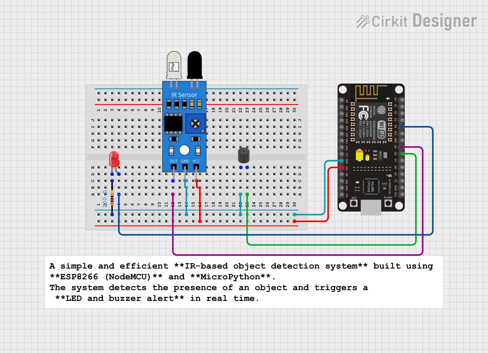

#  Smart IR Object Detection System (ESP8266 | MicroPython)

A simple and efficient **IR-based object detection system** built using **ESP8266 (NodeMCU)** and **MicroPython**.  
The system detects the presence of an object and triggers a **LED and buzzer alert** in real time.

---
##  Project Overview

This project demonstrates how an **IR sensor** can be interfaced with ESP8266 to detect nearby objects.  
When an object is detected, a **LED glows** and a **buzzer sounds**, making it useful for basic security and automation applications.

---

##  Components Required

- ESP8266 (NodeMCU)
- IR Sensor Module
- LED
- Buzzer
- Resistors
- Jumper Wires
- Breadboard (optional)

---

##  Pin Connections (ESP8266)

| Component | ESP8266 Pin | GPIO |
|---------|-------------|------|
| IR Sensor OUT | D5 | GPIO14 |
| LED | D4 | GPIO2 |
| Buzzer | D6 | GPIO12 |

>  Note: Power the IR sensor with **3.3V** to avoid damaging the ESP8266.

---

##  Working Principle

- The IR sensor continuously monitors for object presence.
- When an object comes in front of the sensor, its output goes **LOW**.
- ESP8266 reads this signal and turns **ON the LED and buzzer**.
- When no object is detected, both outputs remain **OFF**.

---

##  Output

- Object detected → **LED ON + Buzzer ON**
- No object detected → **LED OFF + Buzzer OFF**

---

##  Applications

- Intrusion detection system  
- Smart door alert  
- Object counting (with logic update)  
- Robotics obstacle detection  
- Home automation triggers  

---

##  Tools & Technologies

- ESP8266 NodeMCU  
- MicroPython  
- Thonny IDE  

---

##  Future Improvements

-  **Object Counter**  
  - Count number of objects passing in front of the sensor.

-  **Web-Based Monitoring**  
  - Display object detection status on a web dashboard using ESP8266 web server.

-  **Mobile Notification**  
  - Send alerts via Telegram / Blynk / MQTT when an object is detected.

-  **Custom Alert System**  
  - Different buzzer patterns for different detection events.

-  **LCD / OLED Integration**  
  - Show real-time detection status on a display.

-  **Robotics Integration**  
  - Use the IR sensor for obstacle avoidance in robots.

-  **Interrupt-Based Detection**  
  - Improve response time and reduce power consumption.

-  **AI / ML Integration (Advanced)**  
  - Combine with camera or additional sensors for smart decision-making.

---

##  Author

**Kritish Mohapatra**  
MicroPython | ESP32 | Embedded Systems | IoT Projects  
GitHub: [https://github.com/kritishmohapatra]