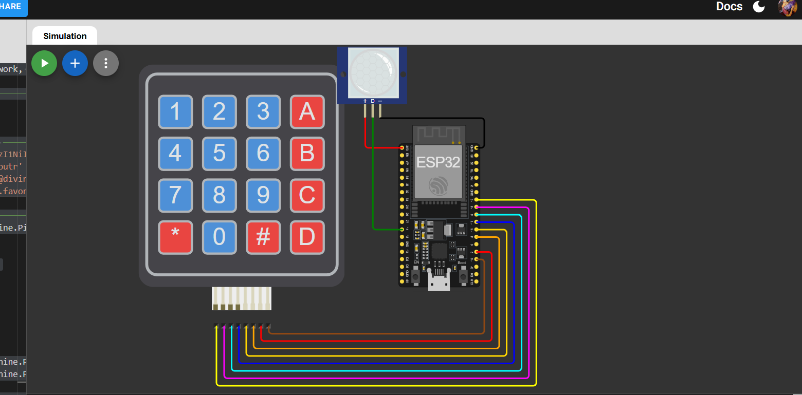
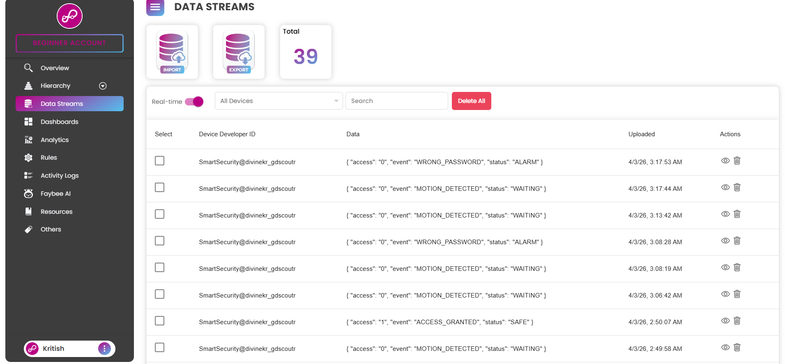
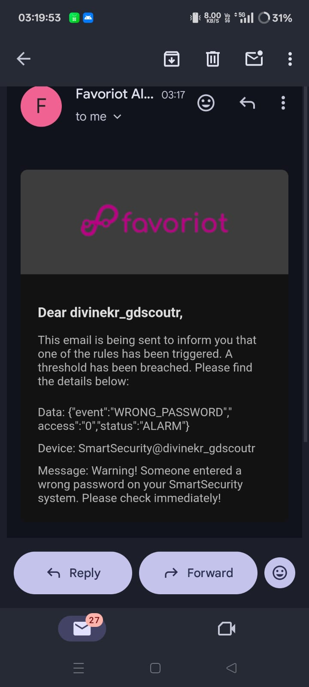

#  Smart Indoor Security System

> ESP32 + PIR Sensor + 4x4 Keypad + MicroPython + Favoriot IoT

A motion-triggered keypad security system that detects intruders, requests a password, logs all events to the Favoriot IoT cloud, and sends email alerts on unauthorized access.

---

##  Features

-  **Motion Detection** — PIR sensor detects any movement
-  **Keypad Authentication** — 4x4 keypad for password entry
-  **Cloud Logging** — All events sent to Favoriot in real-time
-  **Email Alerts** — Automatic email on wrong password or timeout
- **Timeout Protection** — Alarm triggers if no password entered in 30 seconds
-  **Auto Reset** — System resets after each event

---

##  Hardware Required

| Component | Specification |
|-----------|--------------|
| ESP32 DevKit | 30-pin or 38-pin |
| PIR Sensor | HC-SR501 |
| 4x4 Matrix Keypad | Membrane type |
| Jumper Wires | Male-to-Male |

---

##  Wiring



### PIR Sensor
| PIR Pin | ESP32 |
|---------|-------|
| VCC | VIN (5V) |
| GND | GND |
| OUT | GPIO 14 |

### 4x4 Keypad
| Keypad Pin | ESP32 GPIO |
|------------|-----------|
| R1 | GPIO 19 |
| R2 | GPIO 18 |
| R3 | GPIO 5 |
| R4 | GPIO 17 |
| C1 | GPIO 16 |
| C2 | GPIO 4 |
| C3 | GPIO 2 |
| C4 | GPIO 15 |

>  Note: These pin mappings are for Wokwi simulation. For real hardware use standard row/col mapping.

---

##  Setup

### 1. Flash MicroPython on ESP32
```bash
pip install esptool
esptool.py --port COM3 erase_flash
esptool.py --chip esp32 --port COM3 write_flash -z 0x1000 esp32.bin
```
Download firmware from: [micropython.org/download/esp32](https://micropython.org/download/esp32)

### 2. Install Thonny IDE
- Download from [thonny.org](https://thonny.org)
- Tools → Options → Interpreter → **MicroPython (ESP32)**
- Select your COM port

### 3. Favoriot Setup
1. Create free account at [favoriot.com](https://favoriot.com)
2. Create a new device named `SmartSecurity`
3. Copy your **Device Developer ID** → `SmartSecurity@yourusername`
4. Copy your **API Key** from Profile settings

### 4. Favoriot Email Alert (Rules)
1. Go to **Rules** → Create Rule named `Security Alert`
2. Add nodes: `Stream → Condition → Count Trigger → Email`
3. Condition: `event == "WRONG_PASSWORD"`
4. Email Node: add your email and message
5. Save and activate

### 5. Upload Code
- Open `main.py` in Thonny
- Fill in your WiFi and Favoriot credentials
- File → Save As → **MicroPython device** → save as `main.py`

---

##  Keypad Usage

| Key | Action |
|-----|--------|
| `0-9` | Enter password digits |
| `#` | Submit password |
| `*` | Clear / Reset input |

---

##  Favoriot Event Log


| Event | Meaning |
|-------|---------|
| `MOTION_DETECTED` | PIR triggered, waiting for password |
| `ACCESS_GRANTED` | Correct password entered |
| `WRONG_PASSWORD` | Wrong password — email alert sent |
| `TIMEOUT_ALARM` | No input in 30 seconds |

---

##  Simulation (Wokwi)

This project can be simulated on [wokwi.com](https://wokwi.com):

1. New Project → ESP32 → MicroPython
2. Add components: ESP32, PIR Sensor, 4x4 Keypad
3. Wire as per the wiring table above
4. Add `{ "type": "wokwi-network" }` in `diagram.json` for WiFi
5. Use SSID: `Wokwi-GUEST`, Password: `` (empty)
6. Paste the code and run!
https://wokwi.com/projects/457511615174586369

---
##  Future Improvements

- [ ] LCD display for password feedback
- [ ] Wrong password lockout after 3 attempts
- [ ] Telegram notification support
- [ ] Multiple user passwords
- [ ] OTA firmware updates


---

##  Author

**Kritish Mohapatra**  
B.Tech Electrical Engineering (3rd Year)  
IoT | Embedded Systems | MicroPython | ESP32

---

## ⭐ Support

If you like this project, give it a ⭐ on GitHub and feel free to fork it!

Happy hacking 🚀