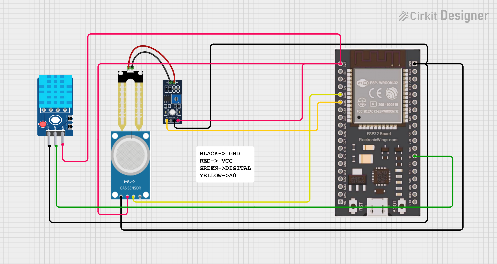
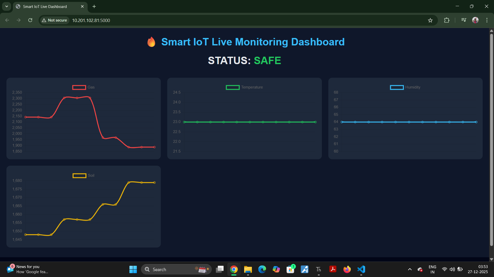
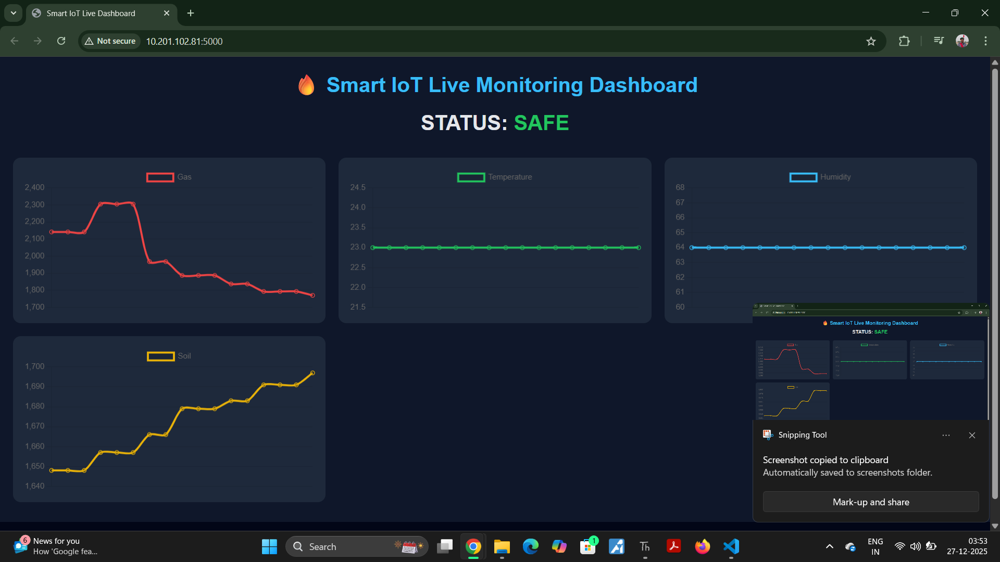

# 🔥 Smart IoT Gas Monitoring System

A complete **end-to-end IoT monitoring system** built using **ESP32, MicroPython, Flask, and AI-based logic** to detect abnormal gas levels and visualize live sensor data on a web dashboard.

---

## 🚀 Project Overview

This project collects real-time data from multiple sensors connected to an **ESP32**, sends it to a **Flask backend**, stores it in a CSV file, and displays **live graphs and status prediction** on a modern web dashboard.

An **AI-inspired moving average logic** is used to classify the environment as **SAFE or DANGER** based on gas behavior.

---

## 🧠 Features

- ✅ Real-time Gas monitoring (MQ Gas Sensor)
- ✅ Temperature & Humidity monitoring (DHT11)
- ✅ Soil / Rain sensor support
- ✅ Live web dashboard (Flask + Chart.js)
- ✅ Dynamic **SAFE / DANGER** prediction
- ✅ AI-style anomaly detection (Moving Average)
- ✅ CSV data logging for analytics
- ✅ Responsive & clean UI

---

## 🛠️ Tech Stack

### 🔌 Hardware
- ESP32
- MQ Gas Sensor
- DHT11 Temperature & Humidity Sensor
- Soil / Rain Sensor
### 💻 Software
- MicroPython (ESP32)
- Python (Flask Backend)
- HTML, CSS, JavaScript
- Chart.js (Live Graphs)

---

## 📊 AI Logic (Simple ML Concept)

The system uses a **moving average–based anomaly detection** approach:

- Maintains a window of recent gas values
- Calculates average gas level
- If current gas value exceeds  
  **Average + Safety Margin → DANGER**
- Else → **SAFE**

This approach simulates **rule-based machine learning**, suitable for beginner AI/ML concepts.

---

## ▶️ How It Works

1. ESP32 reads sensor values  
2. Data is sent to Flask server using HTTP POST  
3. Flask backend:
   - Applies AI logic
   - Stores data in CSV
   - Updates live state  
4. Web dashboard:
   - Fetches live data
   - Displays real-time graphs
   - Shows **SAFE / DANGER** status  

---

## 📸 Screenshots

- 📷 **Dashboard UI**
- 📷 **Circuit Diagram**

## 🔌 ESP32 Pin Connections

| Sensor              | ESP32 Pin | Description |
|---------------------|-----------|-------------|
| MQ Gas Sensor (AO)  | GPIO 34   | Analog gas value |
| Soil / Rain Sensor | GPIO 35   | Analog moisture value |
| DHT11 Data         | GPIO 4    | Temperature & Humidity |
| MQ / Soil VCC      | 3.3V / 5V | Power supply |
| All Sensors GND    | GND       | Common ground |

⚠️ **Note:**  
ESP32 ADC pins used: GPIO 34 & GPIO 35 (input-only, perfect for sensors).

---

## 🎯 Learning Outcomes

- Practical ESP32 + MicroPython usage
- Backend development with Flask
- Real-time data visualization
- Basic AI/ML logic for anomaly detection
- End-to-end IoT system design

---
## 🔗 Future Improvements

- ☁️ Cloud deployment (AWS / Firebase)
- 📱 Mobile dashboard
- 🤖 Advanced ML model
- 🚨 Alert notifications (Email / WhatsApp)

## ❤️Author
**Kritish Mohapatra**  
B.Tech Electrical Engineering (3rd Year)  
IoT | Embedded Systems | MicroPython | ESP32  

---

## ⭐ Support

If you like this project, give it a ⭐ on GitHub and feel free to fork it!

Happy hacking 🚀

