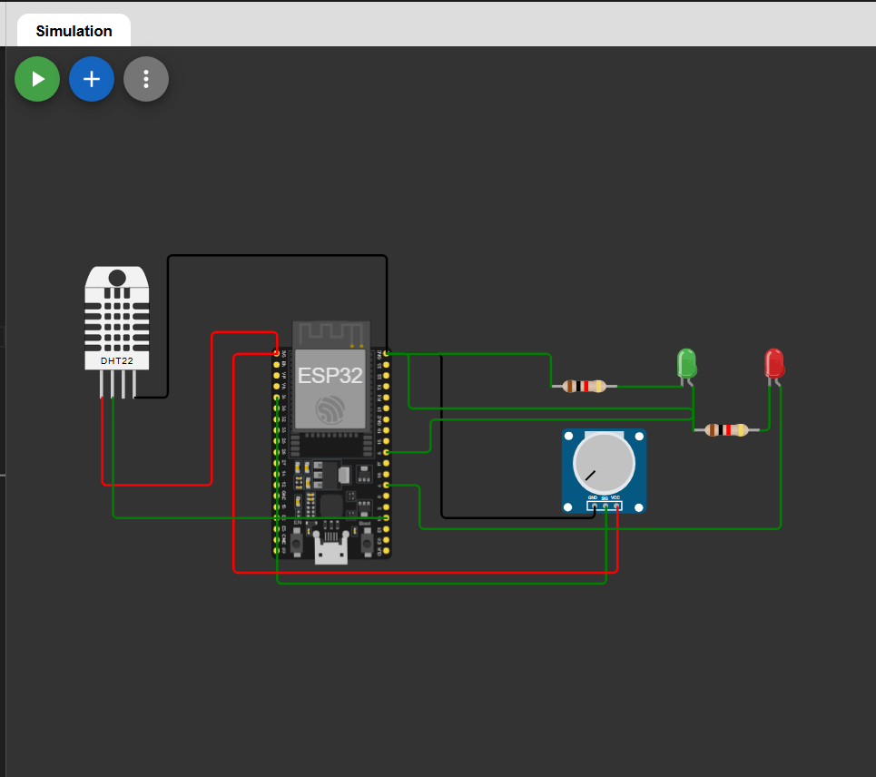
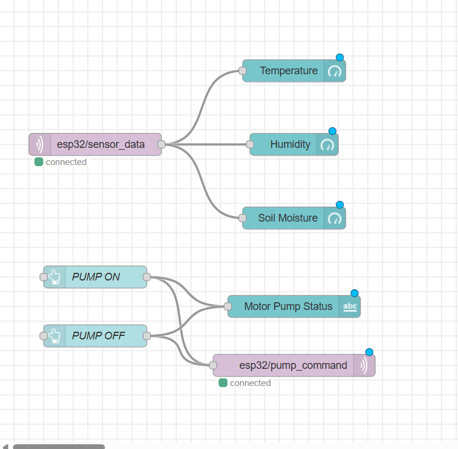
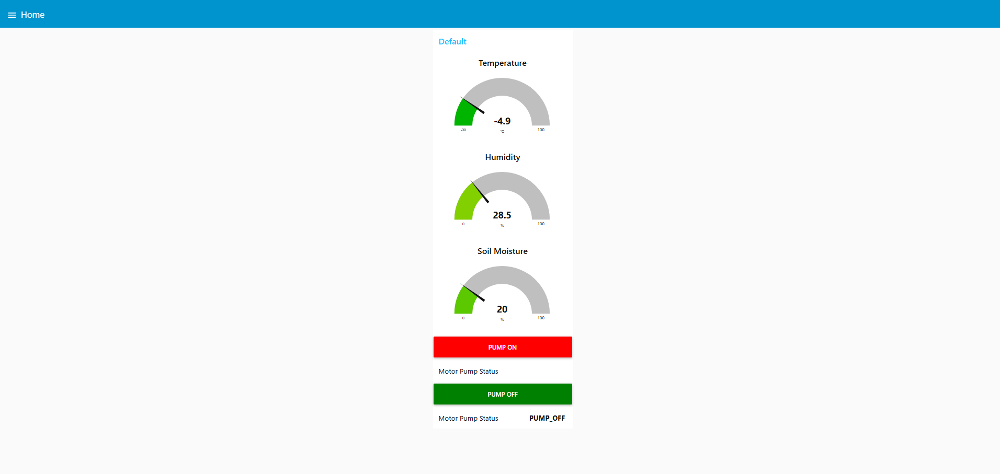

# Smart Irrigation System via Node-RED and MQTT

Monitor soil moisture, temperature, and humidity in real time using an ESP32 simulated in Wokwi (MicroPython), with sensor data sent to a Node-RED dashboard hosted on AWS EC2 over MQTT. The pump can be manually controlled from the dashboard.

## Overview

This project demonstrates cloud-based IoT monitoring and control for smart irrigation. The ESP32 reads DHT22 sensor data and soil moisture from a potentiometer, publishes it to an MQTT broker on AWS EC2, and displays it on a Node-RED dashboard. The dashboard also allows manual pump control via PUMP ON / PUMP OFF buttons, which toggle red and green LEDs on the ESP32 to indicate pump status.

### Wiring



---
## Architecture

```
ESP32 (Wokwi - MicroPython)
  - DHT22 (Temperature + Humidity)
  - Potentiometer (Soil Moisture)
        |
        | publishes to: esp32/sensor_data
        v
Mosquitto MQTT Broker (AWS EC2)
        |
        v
Node-RED Dashboard (Gauges + Pump Control Buttons)
        |
        | publishes to: esp32/pump_command
        v
ESP32 (Red LED / Green LED - Pump Status)
```

## Hardware / Simulation

- ESP32 (simulated in Wokwi)
- DHT22 Temperature and Humidity Sensor (GPIO 15)
- Potentiometer for Soil Moisture simulation (GPIO 34)
- Red LED - Pump ON indicator (GPIO 4)
- Green LED - Pump OFF indicator (GPIO 5)
- 2x 220 ohm resistors (for LEDs)

## Tech Stack

- MicroPython (ESP32)
- Mosquitto MQTT Broker
- Node-RED with node-red-dashboard
- AWS EC2 (Ubuntu 22.04, t2.micro - Free Tier)

## AWS EC2 Setup

### 1. Launch EC2 Instance

- AMI: Ubuntu Server 22.04 LTS (Free Tier Eligible)
- Instance Type: t2.micro
- Storage: 8 GB (default)

### 2. Security Group - Inbound Rules

| Port | Protocol | Source    | Purpose     |
|------|----------|-----------|-------------|
| 22   | TCP      | Your IP   | SSH         |
| 1880 | TCP      | 0.0.0.0/0 | Node-RED UI |
| 1883 | TCP      | 0.0.0.0/0 | MQTT Broker |

### 3. Connect via EC2 Instance Connect

Go to EC2 Console, select your instance, click Connect, and use the EC2 Instance Connect tab to open a browser-based terminal.

## Server Setup

### Install Mosquitto

```bash
sudo apt update && sudo apt upgrade -y
sudo apt install mosquitto mosquitto-clients -y
```

Edit the Mosquitto config:

```bash
sudo nano /etc/mosquitto/mosquitto.conf
```

Add the following lines at the end:

```
listener 1883
allow_anonymous true
```

Start and enable Mosquitto:

```bash
sudo systemctl enable mosquitto
sudo systemctl restart mosquitto
sudo systemctl status mosquitto
```

### Install Node.js and Node-RED

```bash
curl -fsSL https://deb.nodesource.com/setup_18.x | sudo -E bash -
sudo apt install -y nodejs
sudo npm install -g --unsafe-perm node-red
```

### Run Node-RED with PM2

```bash
sudo npm install -g pm2
pm2 start node-red
pm2 startup
pm2 save
```

Node-RED will be accessible at:

```
http://<EC2-PUBLIC-IP>:1880
```

## Node-RED Flow Setup

### Install Dashboard Plugin

1. Open Node-RED in the browser
2. Go to Menu -> Manage Palette -> Install
3. Search for `node-red-dashboard` and install it

### Import the Flow

Go to Menu -> Import and paste the flow JSON from `nodered-flow.json` included in this project. Click Import and then Deploy.

The dashboard will be available at:

```
http://<EC2-PUBLIC-IP>:1880/ui
```

### Dashboard Features

- Temperature gauge (degrees C)
- Humidity gauge (%)
- Soil Moisture gauge (%)
- PUMP ON button (publishes `PUMP_ON` to `esp32/pump_command`)
- PUMP OFF button (publishes `PUMP_OFF` to `esp32/pump_command`)
- Motor Pump Status text display

## MQTT Topics

| Topic                | Direction           | Payload Example                                        |
|----------------------|---------------------|--------------------------------------------------------|
| esp32/sensor_data    | ESP32 -> Node-RED   | `{"temperature": 28.5, "humidity": 65, "moisture": 42}` |
| esp32/pump_command   | Node-RED -> ESP32   | `PUMP_ON` or `PUMP_OFF`                                |


### main.py

```python
import network
import time
from umqttsimple import MQTTClient
from machine import Pin, ADC
import dht
import json

# Pin setup
DHT_PIN = 15
RED_LED = Pin(4, Pin.OUT)
GREEN_LED = Pin(5, Pin.OUT)

sensor = dht.DHT22(Pin(DHT_PIN))
pot = ADC(Pin(34))
pot.atten(ADC.ATTN_11DB)

# Starting state
RED_LED.value(0)
GREEN_LED.value(1)

def connect_wifi():
    wlan = network.WLAN(network.STA_IF)
    wlan.active(True)
    wlan.connect("Wokwi-GUEST", "")
    while not wlan.isconnected():
        print(".", end="")
        time.sleep(0.5)
    print("\nWiFi connected:", wlan.ifconfig()[0])

def on_message(topic, msg):
    message = msg.decode()
    print("Command received:", message)
    if message == "PUMP_ON":
        RED_LED.value(1)
        GREEN_LED.value(0)
        print("ALERT: Pump ON (Motor Irrigating...)")
    elif message == "PUMP_OFF":
        RED_LED.value(0)
        GREEN_LED.value(1)
        print("SAFE: Pump OFF (Moisture Adequate)")

def read_moisture():
    raw = pot.read()
    moisture = int((4095 - raw) / (4095 - 1250) * 100)
    return max(0, min(100, moisture))

connect_wifi()

client = MQTTClient("esp32-irrigation", "<EC2-PUBLIC-IP>", port=1883)
client.set_callback(on_message)
client.connect()
client.subscribe(b"esp32/pump_command")
print("MQTT connected!")

while True:
    client.check_msg()
    try:
        sensor.measure()
        temp = sensor.temperature()
        hum = sensor.humidity()
        moisture = read_moisture()

        payload = json.dumps({
            "temperature": temp,
            "humidity": hum,
            "moisture": moisture
        })

        client.publish(b"esp32/sensor_data", payload)
        print("Published:", payload)

    except Exception as e:
        print("Sensor error:", e)

    time.sleep(1)
```

Replace `<EC2-PUBLIC-IP>` with your actual EC2 instance public IP address.

## How It Works

1. ESP32 reads temperature and humidity from DHT22 every second
2. Potentiometer value is mapped to soil moisture percentage (0-100%)
3. Sensor data is published as JSON to `esp32/sensor_data` over MQTT
4. Node-RED receives the data and displays it on gauges in the dashboard
5. User clicks PUMP ON or PUMP OFF button on the dashboard
6. Node-RED publishes the command to `esp32/pump_command`
7. ESP32 receives the command and toggles the red and green LEDs accordingly

## Notes

- Potentiometer mapping is inverted: fully clockwise = dry (0%), fully counter-clockwise = wet (100%)
- If MQTT connection fails with `OSError: -202` or `ECONNRESET`, restart Mosquitto on EC2 with `sudo systemctl restart mosquitto`
- Green LED on at startup indicates safe/off state by default
- This project uses the AWS Free Tier and will not incur charges under normal usage within free tier limits

## Demo

### Flow



### UI



---


##  Author

**Kritish Mohapatra**  
B.Tech Electrical Engineering (3rd Year)  
IoT | Embedded Systems | MicroPython | ESP32  

---

## ⭐ Support

If you like this project, give it a ⭐ on GitHub and feel free to fork it!

Happy hacking 🚀

