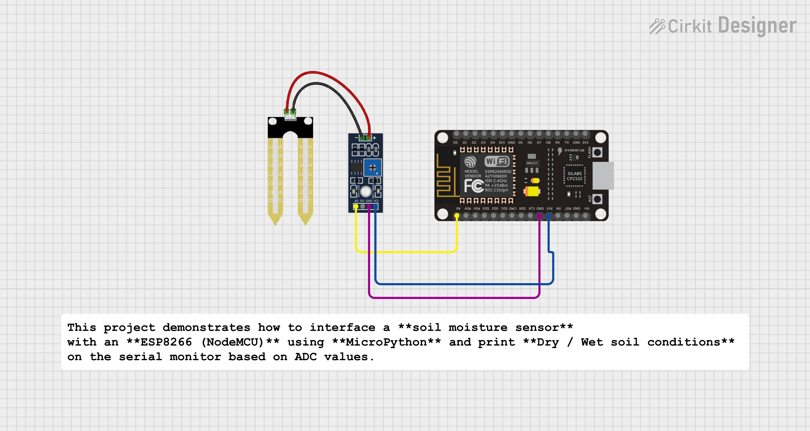

#  Soil Moisture Sensor – Dry/Wet Detection (ESP8266 | MicroPython)

This project demonstrates how to interface a **soil moisture sensor** with an **ESP8266 (NodeMCU)** using **MicroPython** and print **Dry / Wet soil conditions** on the serial monitor based on ADC values.

---

##  Project Overview

- Reads analog soil moisture values using ESP8266 ADC (A0 pin)
- Classifies soil condition as **DRY** or **WET**
- Prints real-time sensor value and status on the serial monitor
- Simple and beginner-friendly project for IoT & embedded systems

---

##  Components Used

- ESP8266 (NodeMCU)
- Soil Moisture Sensor (Analog)
- Breadboard
- Jumper Wires

---

##  Circuit Connections

| Soil Moisture Sensor | ESP8266 |
|---------------------|---------|
| AO                  | A0      |
| VCC                 | 3.3V    |
| GND                 | GND     |

 **Note:**  
- ESP8266 has only **one ADC pin (A0)**  
- Always power the sensor using **3.3V**

---

##  Working Principle

- ESP8266 reads analog value (0–1023) from the soil sensor
- A **threshold value** is used to determine soil condition  
  - Value > threshold → **DRY**
  - Value ≤ threshold → **WET**

---

##  Sample Output

- Soil Value: 820 | Status: DRY
- Soil Value: 450 | Status: WET

---

##  Approximate Sensor Values

| Condition | ADC Value |
|---------|-----------|
| Wet     | 200 – 400 |
| Normal  | 400 – 700 |
| Dry     | 700 – 1023 |

>  Values may vary depending on soil type and sensor quality.

---

##  Applications

- Smart Irrigation Systems  
- Agriculture Monitoring  
- Automatic Water Pump Control  
- IoT-based Farming Solutions  

---

##  Status

-  Tested successfully on ESP8266  
-  Stable readings on serial monitor  

---

##  Future Improvements

- Display values on OLED  
- Control water pump using relay  
- Send data to cloud (ThingSpeak / Blynk)  
- Web dashboard using ESP8266  

##  Author

**Kritish Mohapatra**  
MicroPython | ESP32 | Embedded Systems | IoT Projects  
GitHub: [https://github.com/kritishmohapatra]

## ⭐ Support

If you like this project, give it a ⭐ on GitHub  
and feel free to fork or improve it!