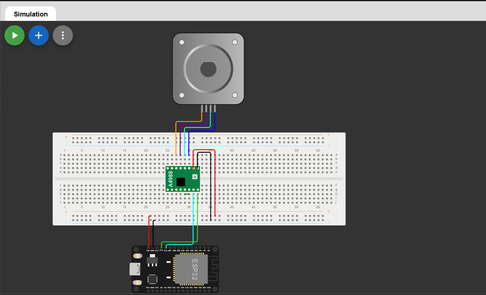

# Stepper Motor Control using ESP32 & A4988 (MicroPython)

This project demonstrates how to control a **NEMA 17 stepper motor** using an **A4988 motor driver** with **ESP32** programmed in **MicroPython**.  
The motor rotates in both **clockwise** and **anticlockwise** directions with serial output for monitoring.

---

##  Components Used

- ESP32 Development Board  
- A4988 Stepper Motor Driver  
- NEMA 17 Bipolar Stepper Motor  
- External Power Supply (9V–12V for motor)  
- Jumper Wires  

---

##  Pin Connections

### ESP32 → A4988 (Logic Side)

| A4988 Pin | ESP32 GPIO | Description |
|----------|------------|-------------|
| STEP | GPIO 14 | Step pulse |
| DIR | GPIO 12 | Direction control |
| ENABLE | GND | Driver always enabled |
| VDD | 3.3V | Logic supply |
| GND | GND | Common ground |

### A4988 → Stepper Motor

| A4988 Pin | Motor Connection |
|----------|------------------|
| 1B | Motor Coil B− |
| 1A | Motor Coil B+ |
| 2A | Motor Coil A+ |
| 2B | Motor Coil A− |

### Motor Power

| A4988 Pin | Connection |
|----------|------------|
| VMOT | External 9–12V |
| GND | Power GND |

 **Note:** VMOT must NOT be powered from ESP32.

---

##  Working Principle

- The **A4988 driver** controls the motor using two signals:
  - **STEP** → each pulse moves the motor by one step  
  - **DIR** → controls the direction of rotation
- ESP32 generates step pulses using GPIO pins.
- `print()` statements display motor status on the serial monitor.

---
##  Serial Output Example

    Stepper motor program started
    Direction: CW
    Moved 200 steps
    Direction: CCW
    Moved 200 steps

##  Simulation

The stepper motor control logic was verified using an online simulation environment.

🔗 **Wokwi Simulation Link:**  
https://wokwi.com/projects/454396262071203841

> Note: The simulation uses Raspberry Pi Pico logic, which is functionally compatible with ESP32/Pico 2W GPIO behavior for STEP and DIR control.

---

##  Rotation Reference

Assuming **200 steps = 360°**:

| Angle | Steps |
|------|-------|
| 90°  | 50    |
| 180° | 100   |
| 360° | 200   |

---

##  Applications

- CNC Machines  
- Robotics  
- 3D Printers  
- Camera Sliders  
- Industrial Automation  

##  Author

**Kritish Mohapatra**  
B.Tech Electrical Engineering (3rd Year)  
IoT | Embedded Systems | MicroPython | ESP32  

---

## ⭐ Support

If you like this project, give it a ⭐ on GitHub and feel free to fork it!

Happy hacking 🚀