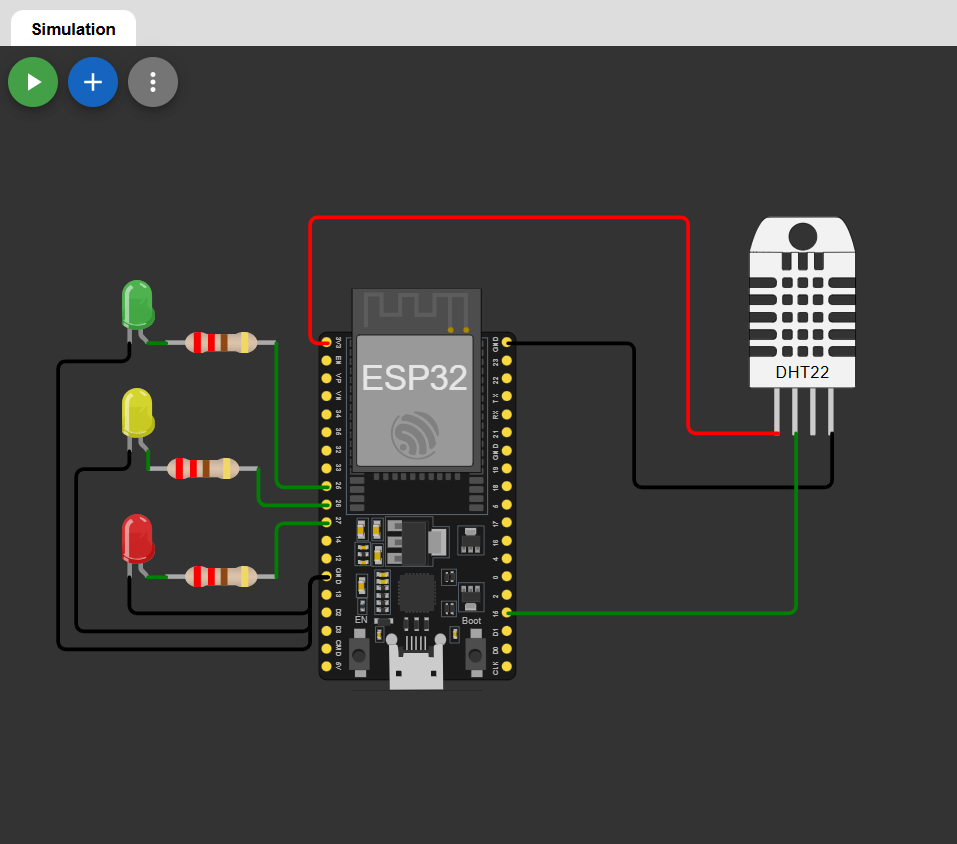

# 🌡️ Temperature Based LED Indicator using ESP32 (MicroPython)

A simple beginner-friendly IoT project built using **ESP32**, **MicroPython**, and **DHT22 sensor**.  
The system reads temperature values and indicates the condition using **LEDs**.

This project is fully **simulated on Wokwi** and is perfect for students who are starting with MicroPython and ESP32.

---

## 🚀 Project Features
- Reads temperature & humidity using DHT22
- Uses LEDs to indicate temperature range
- Simple logic & clean code
- Fully compatible with Wokwi simulation
- Beginner-friendly MicroPython project

---
## 🔗 Wokwi Simulation Link
You can view and run this project simulation on Wokwi here:

👉 https://wokwi.com/projects/454692127203291137

## 🧰 Components Used
- ESP32
- DHT22 Temperature & Humidity Sensor
- 3 LEDs (Red, Yellow, Green)
- 3 × 220Ω Resistors
- Jumper Wires

---

## 🔌 Pin Connections



| Component | ESP32 GPIO |
|---------|------------|
| DHT22 Data | GPIO 15 |
| Green LED | GPIO 25 |
| Yellow LED | GPIO 26 |
| Red LED | GPIO 27 |

---

## 🧠 Working Logic

| Temperature Range | LED Status |
|------------------|-----------|
| Below 25°C | 🟢 Green ON |
| 25°C – 30°C | 🟡 Yellow ON |
| Above 30°C | 🔴 Red ON |

Temperature and humidity values are also printed on the **Serial Monitor**.

---

## 🧾 MicroPython Code

```python
from machine import Pin
import dht
import time

sensor = dht.DHT22(Pin(15))

green = Pin(25, Pin.OUT)
yellow = Pin(26, Pin.OUT)
red = Pin(27, Pin.OUT)

while True:
    try:
        sensor.measure()
        t = sensor.temperature()
        h = sensor.humidity()

        print("Temperature:", t, "°C | Humidity:", h, "%")

        green.off()
        yellow.off()
        red.off()

        if t < 25:
            green.on()
        elif t < 30:
            yellow.on()
        else:
            red.on()

    except:
        print("Sensor Error")

    time.sleep(2)

```
---

## 🎯 Applications
- Room temperature monitoring  
- Beginner IoT learning project  
- ESP32 + MicroPython practice  
- College mini project  

---

## 🔮 Future Improvements
- Add OLED display  
- Add buzzer alert  
- Web dashboard using ESP32  
- MQTT / Cloud integration  
---
 
## ❤️Author
**Kritish Mohapatra**  
B.Tech Electrical Engineering (3rd Year)  
IoT | Embedded Systems | MicroPython | ESP32  

---

## ⭐ Support

If you like this project, give it a ⭐ on GitHub and feel free to fork it!

Happy hacking 🚀

