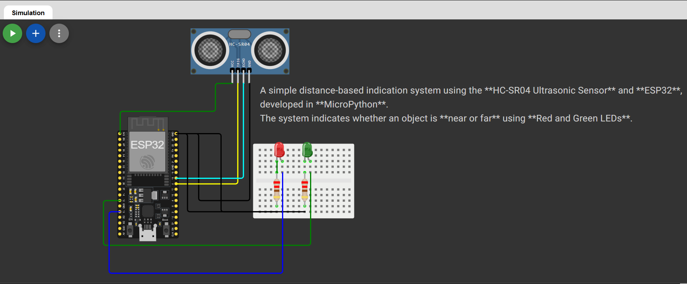

# Ultrasonic Distance Indicator using ESP32 (MicroPython)

A simple distance-based indication system using the **HC-SR04 Ultrasonic Sensor** and **ESP32**, developed in **MicroPython**.  
The system indicates whether an object is **near or far** using **Red and Green LEDs**.

---

## 📌 Project Overview

- Measures distance using an ultrasonic sensor
- Displays distance on Serial Monitor
- Uses LEDs for visual indication:
  - 🟢 **Green LED** → Object is far
  - 🔴 **Red LED** → Object is near
- Simulated using **Wokwi Simulator**

---

## 🛠️ Components Used

- ESP32  
- HC-SR04 Ultrasonic Sensor  
- Red LED  
- Green LED  
- 220Ω Resistors  
- Jumper Wires  

---

## ⚙️ Working Principle

The HC-SR04 sensor sends an ultrasonic pulse through the **TRIG** pin.  
When the pulse hits an object, it reflects back and is received at the **ECHO** pin.  
The time taken for this round trip is used to calculate the distance.

Based on a predefined threshold:
- Distance > 20 cm → Green LED ON  
- Distance ≤ 20 cm → Red LED ON  

---

## 🔌 Pin Configuration (ESP32)

| Component | ESP32 Pin |
|---------|-----------|
| TRIG | GPIO 5 |
| ECHO | GPIO 18 |
| Green LED | GPIO 12 |
| Red LED | GPIO 13 |

> ⚠️ Note: Use a voltage divider for the ECHO pin when using real hardware.

---

## 💻 Software & Tools

- **MicroPython**
- **HC-SR04 MicroPython Library**
- **Wokwi Online Simulator**
- **Thonny IDE** (optional)

---

## 🧪 Simulation

This project was simulated using **Wokwi**.

🔗 **Live Simulation Link:**  
👉 https://wokwi.com/projects/452745513254239233

---

---

## ▶️ How to Run

1. Open the project in **Wokwi**
2. Upload the `main.py` and `hcsr04.py` files
3. Start the simulation
4. Change the distance slider to observe LED behavior

---

## ✅ Output

- Serial monitor displays live distance in cm
- LEDs indicate object proximity in real-time

---

## 📈 Applications

- Obstacle detection system  
- Parking assistance  
- Basic safety alert system  
- Learning project for IoT & Embedded Systems  

---

## 🧑‍💻 Author

**Kritish Mohapatra**  
B.Tech Electrical Engineering (3rd Year)  
IoT | Embedded Systems | MicroPython | ESP32  

---

## ⭐ Support

If you like this project, give it a ⭐ on GitHub and feel free to fork it!

Happy hacking 🚀

