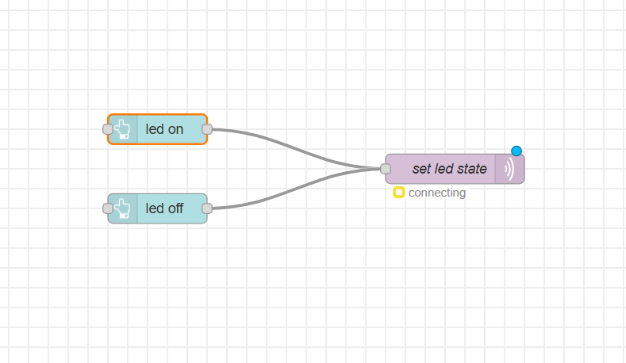

# Virtual LED Control via Node-RED Dashboard & MQTT 

---

##  Overview

Control the onboard LED of a **Raspberry Pi Pico 2W** remotely using a **Node-RED dashboard** virtual button, communicating over **MQTT**. The Pico subscribes to a topic and toggles the LED based on the message received (`on` / `off`).

---

##  Hardware Used

- Raspberry Pi Pico 2W

---

##  Software & Tools

| Tool | Purpose |
|---|---|
| MicroPython | Firmware on Pico 2W |
| Node-RED | Dashboard with virtual ON/OFF button |
| Eclipse Mosquitto | MQTT broker (Docker container) |
| Docker | Running Node-RED & Mosquitto on local machine |
| Oracle VirtualBox | VM hosting Docker environment |

---

##  Architecture

```
Pico 2W (MicroPython)
     ↕  MQTT (topic: led_state)
Mosquitto Broker  ←→  Node-RED Dashboard
(Docker, port 1883)    (Docker, port 1880)
```

- Node-RED dashboard sends `on` or `off` to topic `led_state`
- Pico subscribes to `led_state` and toggles the onboard LED accordingly


---

##  Setup

### 1. Start Docker services (on your local machine / VM)

```bash
docker run -d --name mosquitto -p 1883:1883 eclipse-mosquitto
docker run -d --name nodered -p 1880:1880 nodered/node-red
```

### 2. Configure Pico 2W

Edit `main.py` and update:

```python
SSID     = 'your_wifi_ssid'
PASSWORD = 'your_wifi_password'
SERVER   = '192.168.x.x'   # Your MQTT broker IP
```

Flash `main.py` to Pico 2W using Thonny or mpremote.

### 3. Node-RED Flow

- Open Node-RED at `http://<your-vm-ip>:1880`
- Add two **button** nodes (ON / OFF) from the dashboard palette
- Connect each to a **function** node that sets `msg.payload` to `"on"` or `"off"`
- Connect to an **mqtt out** node with:
  - Topic: `led_state`
  - Broker: your Mosquitto IP, port `1883`
- Deploy and open dashboard at `http://<your-vm-ip>:1880/ui`

---

##  MQTT Topics

| Topic | Message | Action |
|---|---|---|
| `led_state` | `on` | LED turns ON |
| `led_state` | `off` | LED turns OFF |

---

## Demo
### Flows

### Ui


---

##  Libraries

- [`umqtt.simple`](https://github.com/micropython/micropython-lib/tree/master/micropython/umqtt.simple) — built-in MicroPython MQTT library

---


##  Author

**Kritish Mohapatra**  
B.Tech Electrical Engineering (3rd Year)  
IoT | Embedded Systems | MicroPython | ESP32  

---

## ⭐ Support

If you like this project, give it a ⭐ on GitHub and feel free to fork it!

Happy hacking 🚀

