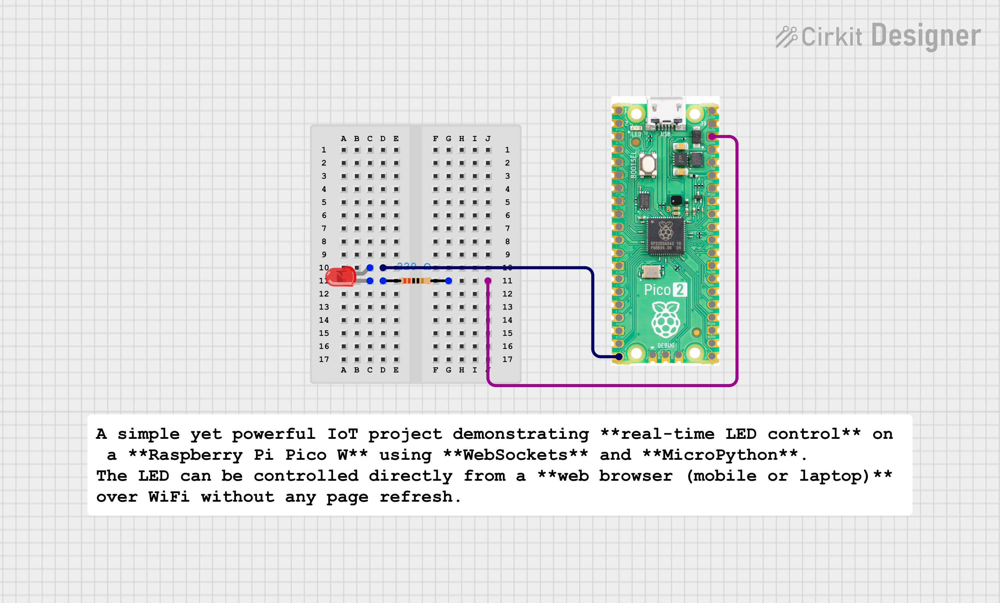

# 🔌 WebSocket LED Control using Raspberry Pi Pico W

A simple yet powerful IoT project demonstrating **real-time LED control** on a **Raspberry Pi Pico W** using **WebSockets** and **MicroPython**.  
The LED can be controlled directly from a **web browser (mobile or laptop)** over WiFi without any page refresh.

---

## 🚀 Project Overview

In this project:
- Raspberry Pi Pico W connects to a WiFi network
- Runs a **WebSocket server** using MicroPython
- A browser-based HTML page acts as a WebSocket client
- User sends `ON` / `OFF` commands
- Pico W decodes (unmasks) WebSocket frames
- LED is controlled in real time

This project focuses on **low-level WebSocket implementation**, including **masking and unmasking**, which is usually hidden in high-level libraries.

---

## 🧠 Key Concepts Covered

- WebSocket protocol (Handshake + Data Frames)
- Browser ↔ Microcontroller communication
- WebSocket **masking & XOR unmasking**
- Socket programming in MicroPython
- Real-time control without HTTP refresh
- Pico W WiFi networking

---

## 🛠 Hardware Required

- Raspberry Pi Pico W  
- LED  
- 220Ω resistor  
- Breadboard  
- Jumper wires  

### 🔗 LED Connection

- LED Anode → GPIO 15 (via 220Ω resistor)
- LED Cathode → GND

---

## 💻 Software Required

- MicroPython firmware for Pico W
- Thonny IDE
- Any modern web browser (Chrome / Edge / Mobile)

---


## ⚙️ How It Works

### 1️⃣ WiFi Connection
Pico W connects to the configured WiFi network and prints its IP address on the serial monitor.

---

### 2️⃣ WebSocket Handshake
- Browser sends a WebSocket handshake request
- Pico W extracts `Sec-WebSocket-Key`
- Generates `Sec-WebSocket-Accept`
- Sends HTTP **101 Switching Protocols** response

---

### 3️⃣ Masked Data Handling (Important)

Browsers **always send masked WebSocket frames**.

So Pico W:
- Extracts the 4-byte masking key
- Applies XOR operation on payload
- Recovers the original message (`ON` / `OFF`)

This step avoids `UnicodeError` and ensures correct decoding.

---

### 4️⃣ LED Control Logic

| Command | Action |
|------|------|
| `ON`  | LED turns ON |
| `OFF` | LED turns OFF |

Pico W also sends a response back to the browser.

---

## 🌐 How to Run the Project

### Step 1: Upload MicroPython Code
- Flash MicroPython on Pico W
- Upload `main.py` using Thonny

---

### Step 2: Power Pico W
- Open Thonny Serial Monitor
- Note the IP address printed

---

### Step 3: Open HTML File
- Open `led.html` in a browser
- Update WebSocket URL:
```js
ws://<PICO_IP>
```
## 🌐 Step 4: Control the LED

- Open the web interface in the browser
- Click **LED ON** / **LED OFF**
- The LED responds instantly ⚡ via WebSocket communication

---

## 🧪 Common Issue & Solution

### ❌ Problem
UnicodeError


### ✅ Reason
Browser sends **masked WebSocket data**.  
Directly decoding the payload without unmasking causes a decoding failure.

### ✅ Solution
Implemented **XOR-based unmasking** of WebSocket frames before decoding the payload.

---

## 📸 Expected Output

### 🖥 Browser


Connected to Pico

Sent: ON

LED ON

Sent: OFF

LED OFF

---
### 🔌 Pico Serial Monitor


Client connected

WebSocket handshake done

Received: ON

Received: OFF


---

## 📈 Future Improvements

- Multiple LED control
- JSON-based commands
- Live sensor data streaming
- Mobile-friendly UI
- Authentication and access control


## 🧑‍💻 Author

**Kritish Mohapatra**  
B.Tech Electrical Engineering (3rd Year)  
IoT | Embedded Systems | MicroPython | ESP32  

---

## ⭐ Support

If you like this project, give it a ⭐ on GitHub and feel free to fork it!

Happy hacking 🚀

