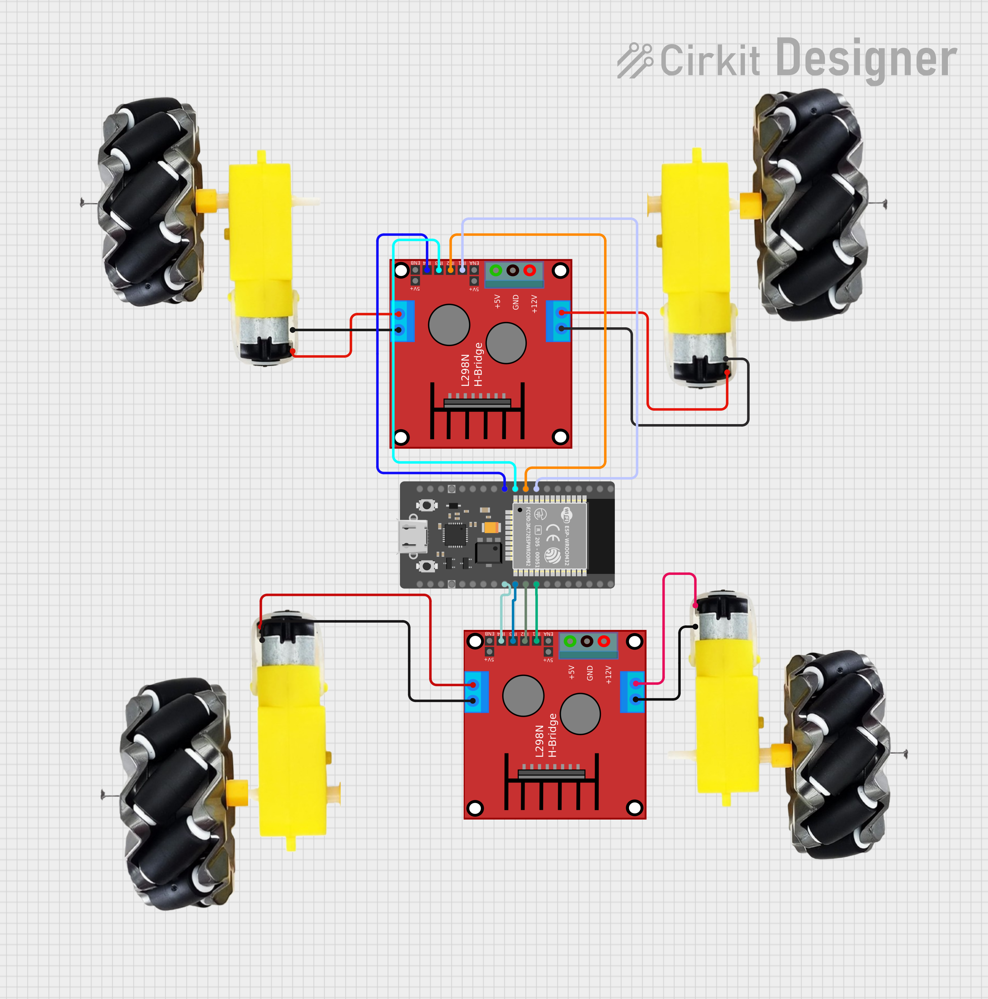

# Wi-Fi Controlled 4WD Robot Car 

Control a 4WD robot car over Wi-Fi using ESP32 and MicroPython! A web interface hosted on the ESP32 lets you drive the car from any browser on your phone or laptop.

---

## Components

| Component | Quantity |
|---|---|
| ESP32 Dev Board | 1 |
| L298N Motor Driver | 2 |
| TT DC Motors | 4 |
| 4WD Car Chassis | 1 |
| 7.4V Li-Po / 4x AA Battery | 1 |
| Jumper Wires | Several |

---

##  Wiring

### ESP32 → Driver 1 (Front Motors)

| ESP32 GPIO | L298N Pin | Motor |
|---|---|---|
| GPIO 27 | IN1 | Front Right |
| GPIO 26 | IN2 | Front Right |
| GPIO 25 | IN3 | Front Left |
| GPIO 33 | IN4 | Front Left |

### ESP32 → Driver 2 (Rear Motors)

| ESP32 GPIO | L298N Pin | Motor |
|---|---|---|
| GPIO 19 | IN1 | Rear Right |
| GPIO 18 | IN2 | Rear Right |
| GPIO 5  | IN3 | Rear Left |
| GPIO 17 | IN4 | Rear Left |

### Power
```
Battery (+) → 12V (both L298N)
Battery (-) → GND (both L298N)
L298N GND   → ESP32 GND (common ground!)
```

>  Common ground between ESP32 and L298N is important!


---

##  How to Use

1. Flash MicroPython on ESP32
2. Replace `your_wifi_name` and `your_wifi_password` with your credentials
3. Upload code using Thonny IDE
4. Open Serial Monitor — note the IP address
5. Open browser on phone/laptop → enter the IP address
6. Control the car using the web interface! 

---

##  How It Works

```
Phone Browser → sends /forward URL
ESP32 receives → calls forward()
Motors run → Car moves forward!
```

- ESP32 hosts a web server on port 80
- Each button on the web page hits a different URL endpoint
- ESP32 reads the URL and calls the matching motor function

---

##  Motor Direction Logic

| Command | Right Motors | Left Motors |
|---|---|---|
| Forward | Forward | Forward |
| Backward | Backward | Backward |
| Left | Forward | Backward |
| Right | Backward | Forward |
| Stop | Stop | Stop |


---

##  Built With

- MicroPython
- ESP32
- L298N Motor Driver
- 4WD Chassis

---


## Author
**Kritish Mohapatra**  
B.Tech Electrical Engineering (3rd Year)  
IoT | Embedded Systems | MicroPython | ESP32  

---

## ⭐ Support

If you like this project, give it a ⭐ on GitHub and feel free to fork it!

Happy hacking 🚀
