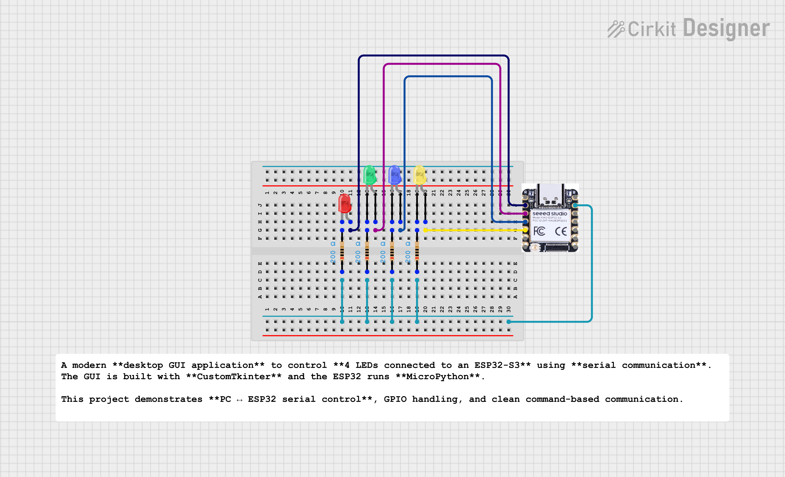

# XIAO ESP32 4-LED Control using CustomTkinter & MicroPython

A modern **desktop GUI application** to control **4 LEDs connected to an ESP32-S3** using **serial communication**.  
The GUI is built with **CustomTkinter** and the ESP32 runs **MicroPython**.

This project demonstrates **PC ↔ ESP32 serial control**, GPIO handling, and clean command-based communication.

---

##  Features

-  Control **4 individual LEDs**
-  Modern **CustomTkinter GUI** (Dark Mode)
-  Stable **Serial Communication**
-  Simple command protocol (`LED1:ON`, `LED2:OFF`)
-  Easily extendable (relay, buzzer, sensors)
-  Internship & Resume Ready Project

---

##  Project Architecture

    PC (CustomTkinter GUI)
    |
    | USB Serial
    v
    ESP32-S3 (MicroPython)
    |
    ├── LED1
    ├── LED2
    ├── LED3
    └── LED4


---

##  Hardware Requirements

- ESP32-S3 (XIAO ESP32-S3 supported)
- 4 × LEDs
- 4 × 220Ω resistors
- USB Cable
- Breadboard & Jumper wires

---

##  LED Pin Configuration



| LED | ESP32 GPIO |
|----|-----------|
| LED1 | GPIO 2 |
| LED2 | GPIO 3 |
| LED3 | GPIO 4 |
| LED4 | GPIO 5 |

>  You can change GPIO pins in the code if needed.

---

##  Software Requirements

### ESP32 Side
- MicroPython Firmware
- Thonny / uPyCraft

### PC Side
- Python 3.9+
- Required Libraries:
```bash
pip install customtkinter pyserial
```
##  ESP32 Code (MicroPython)

Upload this as `main.py` to the ESP32:

```python
from machine import Pin
import sys
import time

leds = {
    "LED1": Pin(2, Pin.OUT),
    "LED2": Pin(3, Pin.OUT),
    "LED3": Pin(4, Pin.OUT),
    "LED4": Pin(5, Pin.OUT),
}

for led in leds.values():
    led.value(0)

print("ESP READY")

while True:
    cmd = sys.stdin.readline()
    if not cmd:
        continue

    cmd = cmd.strip().upper()
    print("RECEIVED:", cmd)

    if ":" in cmd:
        name, action = cmd.split(":", 1)
        if name in leds:
            leds[name].value(1 if action == "ON" else 0)

    time.sleep(0.05)
```
##  PC GUI Code (CustomTkinter)

Run this file on your PC:

```bash
python gui_4led_control.py
```

##  Make sure to set the correct COM port:
```
COM_PORT = "COM14"
```

##  GUI Preview

- Dark Mode UI

- Toggle switches for each LED

- Real-time serial command sending

##  Serial Command Protocol

| Command    | Action        |
| ---------- | ------------- |
| `LED1:ON`  | Turn LED1 ON  |
| `LED1:OFF` | Turn LED1 OFF |
| `LED2:ON`  | Turn LED2 ON  |
| `LED4:OFF` | Turn LED4 OFF |

#  Testing Steps

1. Flash MicroPython on ESP32

2. Upload main.py

3. Connect ESP32 via USB

4. Run GUI Python file

5. Toggle LEDs from GUI 

##  Future Improvements

 -  Real-time LED status feedback

-  ALL ON / ALL OFF button

-  State saving after reboot

-  WiFi + Web dashboard

-  Add relay / buzzer / sensors


##  Author

**Kritish Mohapatra**  
B.Tech Electrical Engineering (3rd Year)  
IoT | Embedded Systems | MicroPython | ESP32  

---

## ⭐ Support

If you like this project, give it a ⭐ on GitHub and feel free to fork it!

Happy hacking 🚀